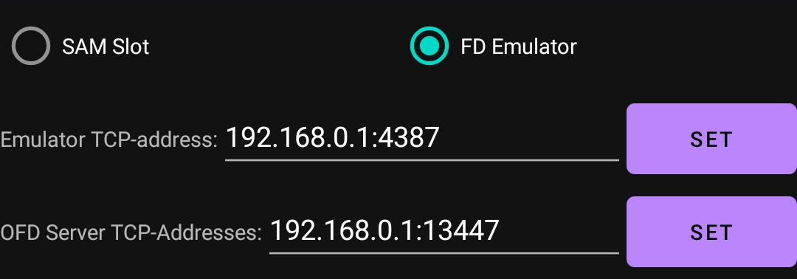
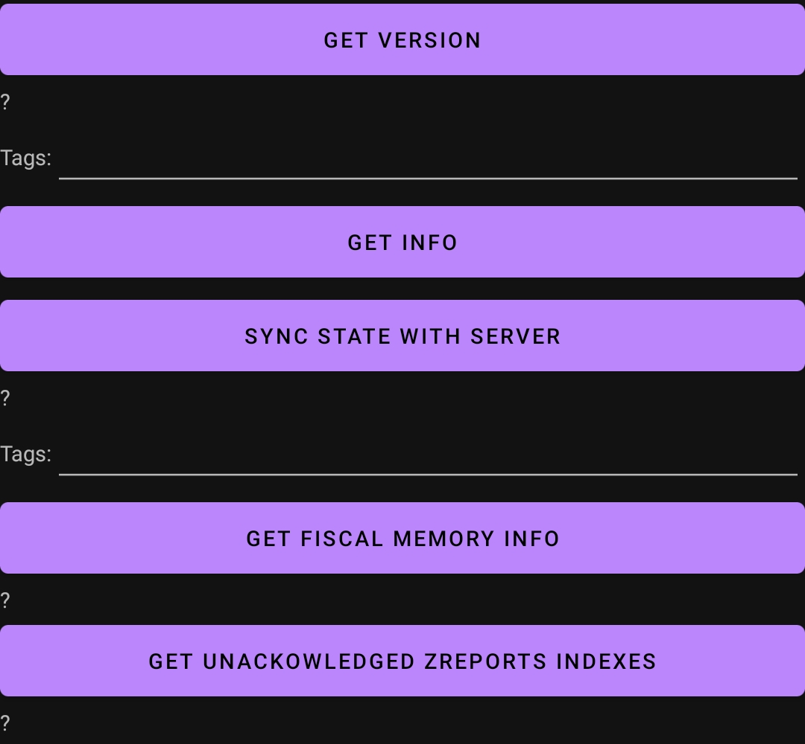
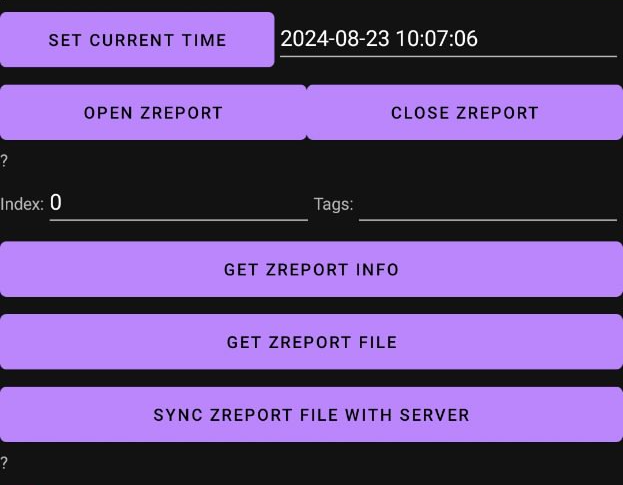
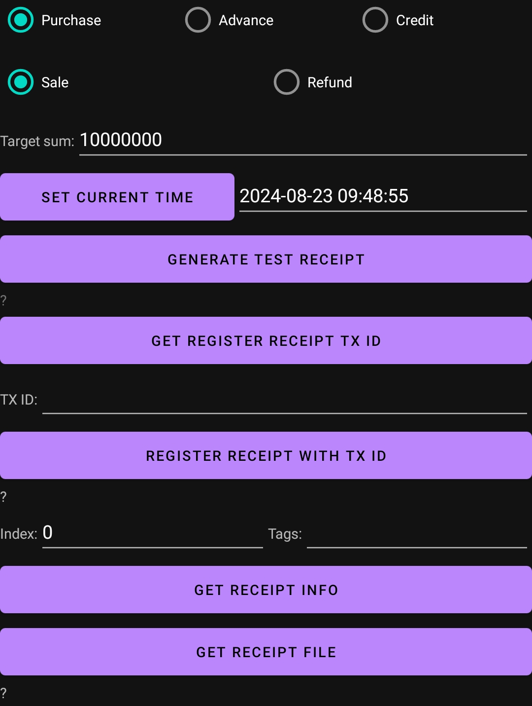
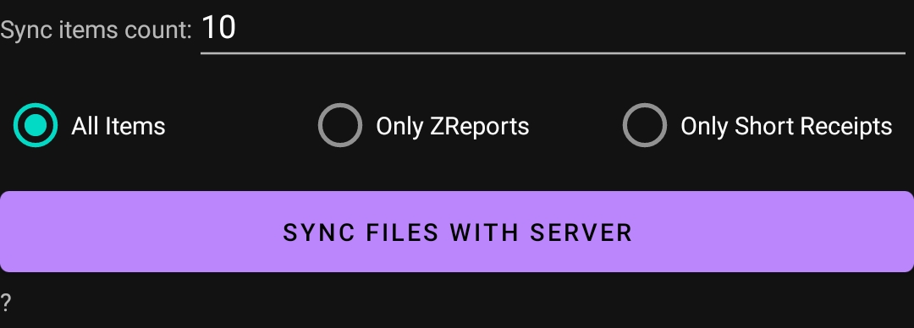
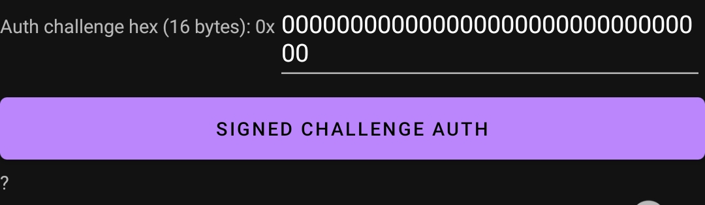
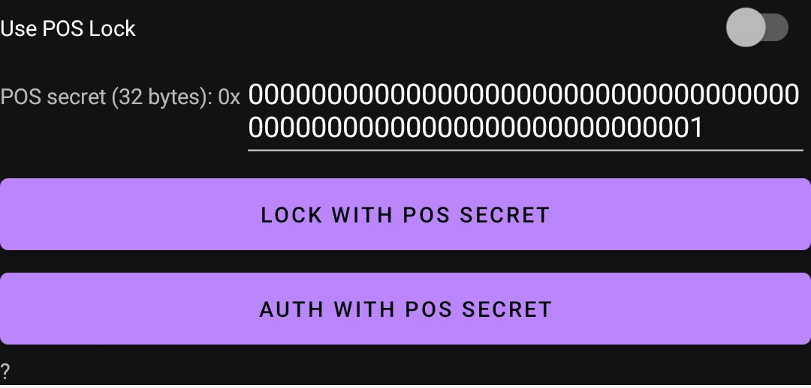

# ИНСТРУКЦИЯ РАЗРАБОТЧИКА КОНТРОЛЬНО-КАССОВОЙ МАШИНЫ НА БАЗЕ ОС ANDROID ДЛЯ ИНТЕГРАЦИИ ФИСКАЛЬНОГО МОДУЛЯ ВЕРСИИ 0400

## ТЕРМИНЫ И ОПРЕДЕЛЕНИЯ

* __ОС__ - Операционная система
* __ККМ__ - Котрольно-кассовая машина.
* __ISO7816__ - Стандарт относится к смарт-картам (в первую очередь контактным). Описывает форму карты, контактов, их расположение и назначение; протоколы обмена и некоторые аспекты работы с данными. 
* __ФМ__ - Фискальный модуль, смарт-карта или USB-токен с ОС JavaCard и установленным апплетов выполняющего функцию фискального модуля.
* __ФП__ - Фискальный признак чека.
* __TLV__ - «Tag-Length-Value» широко распространённый метод записи коротких данных в компьютерных файлах и телекоммуникационных протоколах. 
* __ZReport__ - Запись в ФМ хранит дату-время открытия и закрытия дня и накопленные суммы продаж, возвратов и НДС.
* __ZReportFile__ - Зашифрованный и подписанны ЭЦП ZReport-файл, предназначен для отправки на сервер.
* __Receipt__ - Запись в ФМ хранит дату-время, тип, сумму чека до тех пор пока не произойдет синхронизация с сервером.
* __ReceiptFile__ - Зашифрованный и подписанны ЭЦП Receipt-файл, предназначен для отправки на сервер.
* __FullReceipt__ - Файл чека который содержит всю информацию о чеке (товары/услуги их цены/кол-во и доп. данные).
* __FullReceiptFile__ - Зашифрованный FullReceipt-файл, предназначен для отправки на сервер.
* __AckFile__ - Файл получаемый от сервера для передачи в ФМ для подтверждения доставки ZReport и Receipt.  
* __SyncFile__ - Файл получаемый от сервера для передачи в ФМ для синхронизации времени, состояния ФМ с сервером.  
* __SyncChallenge__ - Применяется при синхронизации времени, состояния ФМ с сервером.
* __reverse-индекс__ - Индекс где 0 - текущий элемент, 1 - предыдущий и т.д.
* __absolute-индекс__ - Абсолютный индекс в памяти ФМ где хранится Receipt или ZReport.


## ВВЕДЕНИЕ

В инструкции приведены описания и принцып работы ФМ версии 0400, примерный проект android-приложения и описания методов для взаимодействия с ФМ

## ФМ версия 0400

Отличия ФМ версии 0400 от прежних версий:

* __Защита от случайной установки будущей даты-врмени__, еслм передаваемое дата-время больше на 2 дня чем дата-время последней операции в ФМ, то ФМ возвратом кода ошибки потребует синхронизацию с сервером для установки серверного даты-время в ФМ.
* __Нет ограничения на кол-во записей ZReport__, Максимальное кол-во зависит от доступной физ.памяти ФМ.
* __Кол-во операции продажа и возврат в одном ZReport до 29999__, в прежних версиях ФМ было до 9999.
* __Нет ограничения на кол-во записей Receipt__, Максимальное кол-во зависит от доступной физ.памяти ФМ.
* __Добавлены типы чеков Аванс и Кредит__, Для этих типов чеков ФМ также выдает порядковый номер чека, но не выдает ФП.
* __Добавлена возможность аутентификации по ФМ__ в IT-системах.
* __Добавлена опция привязки ФМ к POS-системе или ККМ__, при открытии/закрытии ZReport или регистрации чека ФМ потребует секретный ключ.
* __Идемпотентность операций ФМ__, При регистрации чека передача одной и той же команды (много раз) в ФМ будет выполненя одна операция и выдача одного и того же результата (много раз).
* __Выполнена оптимизация работы ФМ__, Сокращено кол-во инструкций и возвращаемых кодов ошибок в ФМ. Данные из ФМ можно запрашивать частично передавая TLV-теги запрашиваемых полей.
* __Разработан эмулятор ФМ__, Для разработки и тестирования ПО для ККМ больше не требуется физ.ФМ, можно запустить программный эмулятор ФМ версии 0400 (входит в состав ПО FiscalDriveService v10).
* __Нет обратной совместимости__ по кодам инструкций, кодам возврата и структурой данных с ФМ прежних версий.

Организация памяти

Разные модели смарт-карт имеют разный объем доступной памяти. Апплет ФМ при открытии ZReport пытается зарезервировать блок памяти для хранения ZReport из доступной памяти. Также и при регистрации нового Receipt. При этом блоки памяти для Receipt которые уже отправлены на сервер и для них был получен AckFile будут переиспользованы для хранения нового Receipt. Следует вовремя отправлять Receipt на сервер, иначе вся доступная память будет заполнена блоками Receipt и при попытке открыть новый ZReport может нехватить блок памяти для нового ZReport.

Пример:

Память нового ФМ

`ZREPORTS_ALLOCATED` = 0<br>
`RECEIPTS_ALLOCATED` = 0<br>
`ZREPORTS_COUNT` = 0<br>
`RECEIPTS_COUNT` = 0<br>

| `   ` | `   ` | `   ` | `   ` | `   ` | `   ` | `   ` | `   ` | `   ` | `   ` | `   ` | `   ` | `   ` | `   ` |
|-------|-------|-------|-------|-------|-------|-------|-------|-------|-------|-------|-------|-------|-------|

После открытия ZReport

`ZREPORTS_ALLOCATED` = 1<br>
`RECEIPTS_ALLOCATED` = 0<br>
`ZREPORTS_COUNT` = 1<br>
`RECEIPTS_COUNT` = 0<br>

| `Z1 ` | `   ` | `   ` | `   ` | `   ` | `   ` | `   ` | `   ` | `   ` | `   ` | `   ` | `   ` | `   ` | `   ` |
|-------|-------|-------|-------|-------|-------|-------|-------|-------|-------|-------|-------|-------|-------|

После регистрации Receipt

`ZREPORTS_ALLOCATED` = 1<br>
`RECEIPTS_ALLOCATED` = 1<br>
`ZREPORTS_COUNT` = 1<br>
`RECEIPTS_COUNT` = 1<br>

| `Z1 ` | `   ` | `   ` | `   ` | `   ` | `   ` | `   ` | `   ` | `   ` | `   ` | `   ` | `   ` | `   ` | `R1 ` |
|-------|-------|-------|-------|-------|-------|-------|-------|-------|-------|-------|-------|-------|-------|

После регистрации 7 Receipt

`ZREPORTS_ALLOCATED` = 1<br>
`RECEIPTS_ALLOCATED` = 8<br>
`ZREPORTS_COUNT` = 1<br>
`RECEIPTS_COUNT` = 8<br>

| `Z1 ` | `   ` | `   ` | `   ` | `   ` | `   ` | `R8 ` | `R7 ` | `R6 ` | `R5 ` | `R4 ` | `R3 ` | `R2 ` | `R1 ` |
|-------|-------|-------|-------|-------|-------|-------|-------|-------|-------|-------|-------|-------|-------|

После закрытия, отправки и открытия ZReport

`ZREPORTS_ALLOCATED` = 2<br>
`RECEIPTS_ALLOCATED` = 8<br>
`ZREPORTS_COUNT` = 2<br>
`RECEIPTS_COUNT` = 8<br>

| `Z1 ` | `Z2 ` | `   ` | `   ` | `   ` | `   ` | `R8 ` | `R7 ` | `R6 ` | `R5 ` | `R4 ` | `R3 ` | `R2 ` | `R1 ` |
|-------|-------|-------|-------|-------|-------|-------|-------|-------|-------|-------|-------|-------|-------|

После отправки Receipt R8,R7,R6 и получения AckFile

`ZREPORTS_ALLOCATED` = 2<br>
`RECEIPTS_ALLOCATED` = 8<br>
`ZREPORTS_COUNT` = 2<br>
`RECEIPTS_COUNT` = 5<br>

| `Z1 ` | `Z2 ` | `   ` | `   ` | `   ` | `   ` | `R. ` | `R. ` | `R. ` | `R5 ` | `R4 ` | `R3 ` | `R2 ` | `R1 ` |
|-------|-------|-------|-------|-------|-------|-------|-------|-------|-------|-------|-------|-------|-------|

После регистрации 2 Receipt

`ZREPORTS_ALLOCATED` = 2<br>
`RECEIPTS_ALLOCATED` = 8<br>
`ZREPORTS_COUNT` = 2<br>
`RECEIPTS_COUNT` = 7<br>

| `Z1 ` | `Z2 ` | `   ` | `   ` | `   ` | `   ` | `R. ` | `R10` | `R9 ` | `R5 ` | `R4 ` | `R3 ` | `R2 ` | `R1 ` |
|-------|-------|-------|-------|-------|-------|-------|-------|-------|-------|-------|-------|-------|-------|

После отправки всех Receipt и получения AckFile

`ZREPORTS_ALLOCATED` = 2<br>
`RECEIPTS_ALLOCATED` = 8<br>
`ZREPORTS_COUNT` = 2<br>
`RECEIPTS_COUNT` = 0<br>

| `Z1 ` | `Z2 ` | `   ` | `   ` | `   ` | `   ` | `R. ` | `R. ` | `R. ` | `R. ` | `R. ` | `R. ` | `R. ` | `R. ` |
|-------|-------|-------|-------|-------|-------|-------|-------|-------|-------|-------|-------|-------|-------|

После закрытия, отправки и открытия ZReport

`ZREPORTS_ALLOCATED` = 3<br>
`RECEIPTS_ALLOCATED` = 8<br>
`ZREPORTS_COUNT` = 3<br>
`RECEIPTS_COUNT` = 0<br>

| `Z1 ` | `Z2 ` | `Z3 ` | `   ` | `   ` | `   ` | `R. ` | `R. ` | `R. ` | `R. ` | `R. ` | `R. ` | `R. ` | `R. ` |
|-------|-------|-------|-------|-------|-------|-------|-------|-------|-------|-------|-------|-------|-------|

Случай когда нет возможности открытия ZReport

`ZREPORTS_ALLOCATED` = 4<br>
`RECEIPTS_ALLOCATED` = 10<br>
`ZREPORTS_COUNT` = 4<br>
`RECEIPTS_COUNT` = 5<br>

| `Z1 ` | `Z2 ` | `Z3 ` | `Z4 ` | `R. ` | `R. ` | `R42` | `R41` | `R40` | `R. ` | `R. ` | `R27` | `R11` | `R. ` |
|-------|-------|-------|-------|-------|-------|-------|-------|-------|-------|-------|-------|-------|-------|

## Инструкции

| Название                       | CLA, INS, P1, P2            | DATA             | Возврат                    | Описание                                                                                                                                                                                                                                                                                                                                                |
|--------------------------------|-----------------------------|------------------|----------------------------|---------------------------------------------------------------------------------------------------------------------------------------------------------------------------------------------------------------------------------------------------------------------------------------------------------------------------------------------------------|
| `GET_VERSION`                  | `0x00`,`0x00`,`0x00`,`0x00` |                  | `short` + `SW`             | Получить версию апплета <br /><sub>(см. класс [uz.yt.ofd.android.lib.applet.command.GetVersionCommand](app/src/main/java/uz/yt/ofd/android/lib/applet/command/GetInfoCommand.java))</sub>                                                                                                                                                               |
| `GET_INFO`                     | `0x00`,`0x00`,`0x01`,`0x00` | `список тегов`   | `Info` + `SW`              | Получить информацию об ФМ, в DATA можно передавать список тегов полей (`[]byte`) <br /><sub>(см. класс [uz.yt.ofd.android.lib.applet.command.GetInfoCommand](app/src/main/java/uz/yt/ofd/android/lib/applet/command/GetInfoCommand.java))</sub>                                                                                                         |
| `GET_FISCAL_MEMORY_INFO`       | `0x00`,`0x00`,`0x02`,`0x00` | `список тегов`   | `FiscalMemoryInfo` + `SW`  | Получить информацию о фискальной памяти ФМ, в DATA можно передавать список тегов полей (`[]byte`) <br /><sub>(см. класс [uz.yt.ofd.android.lib.applet.command.GetFiscalMemoryInfoCommand](app/src/main/java/uz/yt/ofd/android/lib/applet/command/GetFiscalMemoryInfoCommand.java))</sub>                                                                |
| `GET_UNACK_ZREPORTS_INDEXES`   | `0x00`,`0x00`,`0x03`,`0x00` |                  | `short` + `[]short` + `SW` | Получить reverse-индексы неотправленных на сервер ZReport <br /><sub>(см. класс [uz.yt.ofd.android.lib.applet.command.GetUnackowledgedZReportsIndexesCommand](app/src/main/java/uz/yt/ofd/android/lib/applet/command/GetUnackowledgedZReportsIndexesCommand.java))</sub>                                                                                |
| `GET_ZREPORT_INFO`             | `0x00`,`0x01`,`0xXX`,`0xYY` | `список тегов`   | `ZReportInfo` + `SW`       | Получить информацию о ZReport, в P1,P2 передать reverse-индекс а в DATA можно передавать список тегов полей (`[]byte`) <br /><sub>(см. класс [uz.yt.ofd.android.lib.applet.command.GetZReportInfoCommand](app/src/main/java/uz/yt/ofd/android/lib/applet/command/GetZReportInfoCommand.java))</sub>                                                     |
| `GET_ZREPORT_FILE`             | `0x00`,`0x02`,`0xXX`,`0xYY` |                  | `ZReportFile` + `SW`       | Получить файл ZReport для отправки на сервер (в P1,P2 передать reverse-индекс) <br /><sub>(см. класс [uz.yt.ofd.android.lib.applet.command.GetZReportFileCommand](app/src/main/java/uz/yt/ofd/android/lib/applet/command/GetZReportFileCommand.java))</sub>                                                                                             |
| `ZREPORT_OPEN`                 | `0x00`,`0x03`,`0x00`,`0x00` | `дата-время`     | `SW`                       | Открыть ZReport передав дату-время в формате `BCDDateTime` <br /><sub>(см. класс [uz.yt.ofd.android.lib.applet.command.OpenCloseZReportCommand](app/src/main/java/uz/yt/ofd/android/lib/applet/command/OpenCloseZReportCommand.java))</sub>                                                                                                             |
| `ZREPORT_CLOSE`                | `0x00`,`0x03`,`0x01`,`0x00` | `дата-время`     | `SW`                       | Закрыть ZReport передав дату-время в формате `BCDDateTime` <br /><sub>(см. класс [uz.yt.ofd.android.lib.applet.command.OpenCloseZReportCommand](app/src/main/java/uz/yt/ofd/android/lib/applet/command/OpenCloseZReportCommand.java))</sub>                                                                                                             |
| `GET_RECEIPT_INFO`             | `0x00`,`0x05`,`0xXX`,`0xYY` | `список тегов`   | `ReceiptInfo` + `SW`       | Получить информацию о Receipt, в P1,P2 передать reverse-индекс а в DATA можно передавать список тегов полей (`[]byte`) <br /><sub>(см. класс [uz.yt.ofd.android.lib.applet.command.GetReceiptInfoCommand](app/src/main/java/uz/yt/ofd/android/lib/applet/command/GetReceiptInfoCommand.java))</sub>                                                     |
| `GET_RECEIPT_FILE`             | `0x00`,`0x06`,`0xXX`,`0xYY` |                  | `ReceiptFile` + `SW`       | Получить файл Receipt для отправки на сервер (в P1,P2 передать reverse-индекс) <br /><sub>(см. класс [uz.yt.ofd.android.lib.applet.command.GetReceiptFileCommand](app/src/main/java/uz/yt/ofd/android/lib/applet/command/GetReceiptFileCommand.java))</sub>                                                                                             |
| `ACK`                          | `0x00`,`0x09`,`0xXX`,`0xYY` | `AckFile`        | `SW`                       | Передать в ФМ `AckFile` (для быстрого выполнения нужно в P1,P2 передать absolute-индекс ZReport/Receipt в памяти ФМ) от сервера полученный в ответ на передачу `ZReportFile` или `ReceiptFile` <br /><sub>(см. класс [uz.yt.ofd.android.lib.applet.command.AckCommand](app/src/main/java/uz/yt/ofd/android/lib/applet/command/AckCommand.java))</sub>   |
| `SYNC`                         | `0x00`,`0x11`,`0x00`,`0x00` | `SyncFile`       | `SW`                       | Синхронизации времени, состояния ФМ с сервером <br /><sub>(см. класс [uz.yt.ofd.android.lib.applet.command.SyncCommand](app/src/main/java/uz/yt/ofd/android/lib/applet/command/SyncCommand.java))</sub>                                                                                                                                                 |
| `RECEIPT_REGISTER`             | `0x00`,`0x17`,`0x00`,`0x00` | `TotalBlock`     | `FiscalSignInfo` + `SW`    | Зарегистрировать чек передав `TotalBlock` и получить в ответ ФП <br /><sub>(см. класс [uz.yt.ofd.android.lib.applet.command.RegisterReceiptCommand](app/src/main/java/uz/yt/ofd/android/lib/applet/command/RegisterReceiptCommand.java))</sub>                                                                                                          |
| `SIGNED_CHALLENGE_AUTH`        | `0x00`,`0x0b`,`0x00`,`0x00` | `Challenge`      | `SignedChallenge` + `SW`   | Аутентификации по ФМ передав `Challenge` и получить в ответ подписанный `Challenge` <br /><sub>(см. класс [uz.yt.ofd.android.lib.applet.command.SignedChallengeAuthCommand](app/src/main/java/uz/yt/ofd/android/lib/applet/command/SignedChallengeAuthCommand.java))</sub>                                                                              |
| `POS_LOCK`                     | `0x00`,`0x0c`,`0x00`,`0x00` | `секретный ключ` | `SW`                       | Привязка ФМ к ККМ <br /><sub>(см. класс [uz.yt.ofd.android.lib.applet.command.POSLockCommand](app/src/main/java/uz/yt/ofd/android/lib/applet/command/POSLockCommand.java))</sub>                                                                                                                                                                        |
| `POS_CHALLENGE`                | `0x00`,`0x0c`,`0x01`,`0x00` |                  | `POSChallenge` + `SW`      | Запрос `POSChallenge` из ФМ <br /><sub>(см. класс [uz.yt.ofd.android.lib.applet.command.POSChallengeCommand](app/src/main/java/uz/yt/ofd/android/lib/applet/command/POSChallengeCommand.java))</sub>                                                                                                                                                    |
| `POS_AUTH`                     | `0x00`,`0x0c`,`0x02`,`0x00` | `POSAuth`        | `SW`                       | Передать `POSAuth = SHA-256(секретный ключ + POSChallenge)` в ФМ после которого можно выполнить операцию открытии/закрытии ZReport или регистрации чека ФМ <br /><sub>(см. класс [uz.yt.ofd.android.lib.applet.command.POSAuthCommand](app/src/main/java/uz/yt/ofd/android/lib/applet/command/POSAuthCommand.java))</sub>                               |

## Коды возврата SW

ФМ всегда (по ISO7816) возвращает 2х байтовый SW-код после выполнения инструкции. Если ответ от ФМ не вернулся,то скорее всего проблема в драйвере SAM-считывателя.

| Код      | Название                                | Описание                                                                                                                                                                                                    |
|----------|-----------------------------------------|-------------------------------------------------------------------------------------------------------------------------------------------------------------------------------------------------------------|
| `0x9000` | `NO_ERROR`                              | Успешно                                                                                                                                                                                                     |
| `0x9010` | `INVALID_DATETIME`                      | Передано неправильное значение даты-времени (должно быть в формате BCDDateTime)                                                                                                                             |
| `0x9011` | `INVALID_INDEX`                         | Передано неправильное значение индекса (должно быть от 0 до 32767)                                                                                                                                          |
| `0x9012` | `INVALID_BCD`                           | Передано неправильное значение числа (должно быть в формате BCD8)                                                                                                                                           |
| `0x9013` | `INVALID_TYPE`                          | Передано неправильное значение типа чека                                                                                                                                                                    |
| `0x9014` | `INVALID_OPERATION`                     | Передано неправильное значение типа операции                                                                                                                                                                |
| `0x9015` | `INVALID_ACK_SIGNATURE`                 | Передано неправильное значение AckFile                                                                                                                                                                      |
| `0x9016` | `WRONG_TERMINAL_ID`                     | Передано неправильное значение AckFile (возможно AckFile не для этого ФМ)                                                                                                                                   |
| `0x9017` | `INVALID_SYNC_SIGNATURE`                | Передано неправильное значение SyncFile                                                                                                                                                                     |
| `0x9018` | `WRONG_SYNC_CHALLENGE`                  | Передано неправильное значение SyncChallenge (возможно был повторно передан прежний SyncFile)                                                                                                               |
| `0x9020` | `NOT_FOUND`                             | Запрашиваемая запись ненайдена. Может быть при повторной передачи AckFile в ФМ или при передачи индекса для получения записи которого нет в ФМ                                                              |
| `0x9021` | `ZREPORT_IS_NOT_OPENED`                 | Не выполнена операция открытия ZReport                                                                                                                                                                      |
| `0x9022` | `ZREPORT_IS_NOT_CLOSED`                 | Не выполнена операция заккрытия ZReport                                                                                                                                                                     |
| `0x9023` | `ZREPORT_IS_ALREADY_CLOSED`             | ZReport уже был закрыт, выполните операцию открытия ZReport                                                                                                                                                 |
| `0x9030` | `DATETIME_IS_IN_THE_PAST`               | Передаваемое дата-время ранее (прошлое) или равно дате-время последней операции в ФМ (Передаваемое дата-время должно быть как минимум на 1 сек. позьже чем дата-время последней операции в ФМ)              |
| `0x9031` | `SEND_ALL_RECEIPTS_FIRST`               | В ФМ хранятся чеки более чем 2 дня, выполните синхронизацию файлов с сервером                                                                                                                               |
| `0x9032` | `CANNOT_CLOSE_EMPTY_ZREPORT`            | Нельзя выполнить операцию заккрытия ZReport если в нем не заригистрирована минимум 1 операция продажи или возврата                                                                                          |
| `0x9033` | `RECIPT_SEQ_MAX_VALUE_REACHED`          | Достигнут максимальный номмер чека в ФМ. Следует заменить ФМ на новый.                                                                                                                                      |
| `0x9034` | `CASH_CARD_ACCUMULATOR_OVERFLOW`        | Достигнута максимальная накопленная сумма в фискальной памяти ФМ при операции возврат. Следует заменить ФМ на новый.                                                                                        |
| `0x9035` | `NOT_ENOUGH_SUM_FOR_REFUND`             | В фискальной памяти ФМ надостаточно суммы от продаж для выполнения операции возврат                                                                                                                         |
| `0x9036` | `VAT_ACCUMULATOR_OVERFLOW`              | Достигнута максимальная накопленная сумма НДС в фискальной памяти ФМ. Следует заменить ФМ на новый.                                                                                                         |
| `0x9037` | `NOT_ENOUGH_VAT_FOR_REFUND`             | В фискальной памяти ФМ надостаточно суммы НДС от продаж для выполнения операции возврат                                                                                                                     |
| `0x9040` | `TOTAL_COUNT_OVERFLOW_OPEN_NEW_ZREPORT` | Достигнуто максимальное кол-во операций (29999) в текущем ZReport. Закройта текущий ZReport и откройте новый.                                                                                               |
| `0x9041` | `TOTAL_CASH_OVERFLOW_OPEN_NEW_ZREPORT`  | Достигнута максимальная накопленная сумма в текущем ZReport. Закройта текущий ZReport и откройте новый.                                                                                                     |
| `0x9042` | `TOTAL_CARD_OVERFLOW_OPEN_NEW_ZREPORT`  | Достигнута максимальная накопленная сумма в текущем ZReport. Закройта текущий ZReport и откройте новый.                                                                                                     |
| `0x9043` | `TOTAL_VAT_OVERFLOW_OPEN_NEW_ZREPORT`   | Достигнута максимальная накопленная сумма НДС в текущем ZReport. Закройта текущий ZReport и откройте новый.                                                                                                 |
| `0x9044` | `CASH_ACCUMULATOR_OVERFLOW`             | Достигнута максимальная накопленная сумма в фискальной памяти ФМ при операции продажа. Следует заменить ФМ на новый.                                                                                        |
| `0x9045` | `CARD_ACCUMULATOR_OVERFLOW`             | Достигнута максимальная накопленная сумма в фискальной памяти ФМ при операции продажа. Следует заменить ФМ на новый.                                                                                        |
| `0x9090` | `LOCKED_SYNC_WITH_SERVER`               | ФМ заблокирован. Требуется синхронизация состояния ФМ с сервером.                                                                                                                                           |
| `0x9091` | `DATETIME_SYNC_WITH_SERVER`             | Передаваемое дата-время больше на 2 дня чем дата-время последней операции в ФМ. Настройте реальное время в ККМ и повторите попытку или выполните синхронизацию состояния ФМ с сервером и повторите попытку. |
| `0x9092` | `ALREADY_POS_LOCKED`                    | ФМ уже привязан к POS-системе или к ККМ секретным ключем.                                                                                                                                                   |
| `0x9093` | `POS_AUTH_FAIL`                         | ФМ тебует передачи правильного секретного ключа для идентификации POS-системы или ККМ.                                                                                                                      |
| `0x90F0` | `ZREPORTS_MEMORY_FULL`                  | Память ФМ для хранения ZReport заполнена. Следует заменить ФМ на новый.                                                                                                                                     | 
| `0x90F1` | `RECEIPTS_MEMORY_FULL`                  | Память ФМ для хранения Receipt заполнена, выполните синхронизацию файлов с сервером для освобождения памяти.                                                                                                | 
| `0x90FF` | `NOT_ENOUGH_MEMORY`                     | Память ФМ заполнена, выполните синхронизацию файлов (и синхронизация состояния ФМ) с сервером для освобождения памяти.                                                                                      |
| `0x6A86` | `INCORRECT_P1P2`                        | Передано неправильное значение параметров P1,P2                                                                                                                                                             |
| `0x6D00` | `INS_NOT_SUPPORTED`                     | Передано неправильное значение параметра INS                                                                                                                                                                |
| `0x6700` | `WRONG_LENGTH`                          | Передано неправильный размер DATA                                                                                                                                                                           |
| `0x6A80` | `WRONG_DATA`                            | Передано неправильное значение DATA                                                                                                                                                                         |
| `0x6F00` | `UNKNOWN`                               | Обычно данная ошибка возникает при недостатке памяти или ее повреждения. Проверьте кол-во свободной памяти ФМ. Попробуйте выполнить синхронизацию состояния ФМ с сервером и повторите попытку.              |

_Другие коды возвращаются OC смарт-карты. См._  [Complete list of APDU responses](https://www.eftlab.com/knowledge-base/complete-list-of-apdu-responses)

> см. класс [uz.yt.ofd.android.lib.applet.SW](app/src/main/java/uz/yt/ofd/android/lib/applet/SW.java)

## Типы данных

### short

`short` - 16-битное BigEndian число со знаком.

### BCD

`BCD` - Двоично-десятичное LittleEndian число

Пример:

|   Десятичное число |   BCD представление |
|-------------------:|--------------------:|
|             `6162` |            `0x2616` |
|           `831089` |          `0x980138` |
|         `64852092` |        `0x29025846` |
|       `2230821535` |      `0x5351280322` |
|     `791947779410` |    `0x014977749197` |

> см. класс [uz.yt.ofd.android.lib.codec.BCD8](app/src/main/java/uz/yt/ofd/android/lib/codec/BCD8.java)

### TerminalID

`TerminalID` - Серийный номер ФМ, состоит из двух лат . загл. буквы и 12 цифр.

Пример:

|           Сер. № |    HEX представление |
|-----------------:|---------------------:|
| `UZ724549167320` | `0x555a724549167320` |
| `UZ684487745566` | `0x555a684487745566` |
| `UZ354186551956` | `0x555a354186551956` |
| `VG949183117216` | `0x5647949183117216` |
| `ZZ077335055257` | `0x5a5a077335055257` |

> см. класс [uz.yt.ofd.android.lib.codec.TerminalID](app/src/main/java/uz/yt/ofd/android/lib/codec/TerminalID.java)

### BCDDateTime

`BCDDateTime` - Дата и время формата `ГГГГММДДTЧЧМИСС` (`T` - разделитель).

Пример:

|            Дата и время   |  HEX представление   |
|--------------------------:|---------------------:|
| `2023-01-27 'T' 12:38:25` | `0x2023012754123825` |
| `2023-12-12 'T' 02:29:28` | `0x2023121254022928` |
| `2025-02-11 'T' 18:40:02` | `0x2025021154184002` |
| `2022-09-05 'T' 21:15:56` | `0x2022090554211556` |
| `2025-06-02 'T' 13:55:37` | `0x2025060254135537` |

> см. класс [uz.yt.ofd.android.lib.codec.BCDDateTime](app/src/main/java/uz/yt/ofd/android/lib/codec/BCDDateTime.java)

### FiscalSign

`FiscalSign` - ФП чека (Двоично-десятичное BigEndian число).

Пример:

|                  ФП чека | HEX представление  |
|-------------------------:|-------------------:|
|           `483838182873` |   `0x483838182873` |
|           `312327420776` |   `0x312327420776` |
|           `511765359899` |   `0x511765359899` |
|           `610539110790` |   `0x610539110790` |
|           `150708129139` |   `0x150708129139` |

### CRC32

`CRC32` - Контрольная сумма данных Castagnoli's polynomial [https://dx.doi.org/10.1109/26.231911](https://dx.doi.org/10.1109/26.231911).

Пример:

| Данные                                                    | CRC32 (HEX представление) |
|:----------------------------------------------------------|:-------------------------:|
| `TEST MESSAGE`                                            |       `0x578f5341`        |
| `HELLO WORLD`                                             |       `0xc481333f`        |
| `0123456789`                                              |       `0x280c069e`        |
| `This is a test message lenght=32`                        |       `0xe5c72eb0`        |
| `2021-07-26 12:38:48.157930054 +0500 +05 m=+12.220548675` |       `0xc6706bc9`        |

> см. класс [uz.yt.ofd.android.lib.codec.Crc32c](app/src/main/java/uz/yt/ofd/android/lib/codec/Crc32c.java)

### Тип чека

| Тип чека          | Значение |
|-------------------|:--------:|
| Обычный (покупка) |  `0x00`  |
| Аванс             |  `0x01`  |
| Кредит            |  `0x02`  |

> см. класс [uz.yt.ofd.android.lib.codec.receipt20.ReceiptType](app/src/main/java/uz/yt/ofd/android/lib/codec/receipt20/ReceiptType.java)

### Тип операции

| Тип операции    | Значение |
|-----------------|:--------:|
| Продажа         |  `0x00`  |
| Возврат (отзыв) |  `0x01`  |

> см. класс [uz.yt.ofd.android.lib.codec.receipt20.OperationType](app/src/main/java/uz/yt/ofd/android/lib/codec/receipt20/OperationType.java)

### NAME

`NAME` - Название товара/услуги. Символы поля `NAME` чека в кодировке преобразуются по таблицы преобразования

| DEC |  HEX | CHAR | UNICODE |     DEC |    HEX | CHAR |  UNICODE |
| ---:|-----:|-----:|--------:|--------:|-------:|-----:|---------:|
|   0 | `00` |    А |  `0410` |     128 |   `80` |    A |   `0041` |
|   1 | `01` |    Б |  `0411` |     129 |   `81` |    B |   `0042` |
|   2 | `02` |    В |  `0412` |     130 |   `82` |    C |   `0043` |
|   3 | `03` |    Г |  `0413` |     131 |   `83` |    D |   `0044` |
|   4 | `04` |    Д |  `0414` |     132 |   `84` |    E |   `0045` |
|   5 | `05` |    Е |  `0415` |     133 |   `85` |    F |   `0046` |
|   6 | `06` |    Ё |  `0401` |     134 |   `86` |    G |   `0047` |
|   7 | `07` |    Ж |  `0416` |     135 |   `87` |    H |   `0048` |
|   8 | `08` |    З |  `0417` |     136 |   `88` |    I |   `0049` |
|   9 | `09` |    И |  `0418` |     137 |   `89` |    J |   `004a` |
|  10 | `0a` |    Й |  `0419` |     138 |   `8a` |    K |   `004b` |
|  11 | `0b` |    К |  `041a` |     139 |   `8b` |    L |   `004c` |
|  12 | `0c` |    Л |  `041b` |     140 |   `8c` |    M |   `004d` |
|  13 | `0d` |    М |  `041c` |     141 |   `8d` |    N |   `004e` |
|  14 | `0e` |    Н |  `041d` |     142 |   `8e` |    O |   `004f` |
|  15 | `0f` |    О |  `041e` |     143 |   `8f` |    P |   `0050` |
|  16 | `10` |    П |  `041f` |     144 |   `90` |    Q |   `0051` |
|  17 | `11` |    Р |  `0420` |     145 |   `91` |    R |   `0052` |
|  18 | `12` |    С |  `0421` |     146 |   `92` |    S |   `0053` |
|  19 | `13` |    Т |  `0422` |     147 |   `93` |    T |   `0054` |
|  20 | `14` |    У |  `0423` |     148 |   `94` |    U |   `0055` |
|  21 | `15` |    Ф |  `0424` |     149 |   `95` |    V |   `0056` |
|  22 | `16` |    Х |  `0425` |     150 |   `96` |    W |   `0057` |
|  23 | `17` |    Ц |  `0426` |     151 |   `97` |    X |   `0058` |
|  24 | `18` |    Ч |  `0427` |     152 |   `98` |    Y |   `0059` |
|  25 | `19` |    Ш |  `0428` |     153 |   `99` |    Z |   `005a` |
|  26 | `1a` |    Щ |  `0429` |     154 |   `9a` |    Ö |   `00d6` |
|  27 | `1b` |    Ъ |  `042a` |     155 |   `9b` |    Ç |   `00c7` |
|  28 | `1c` |    Ы |  `042b` |     156 |   `9c` |    Ğ |   `011e` |
|  29 | `1d` |    Ь |  `042c` |     157 |   `9d` |    Ş |   `015e` |
|  30 | `1e` |    Э |  `042d` |     158 |   `9e` |    Ü |   `00dc` |
|  31 | `1f` |    Ю |  `042e` |     159 |   `9f` |    Ŋ |   `014a` |
|  32 | `20` |    Я |  `042f` |     160 |   `a0` |    Ӑ |   `04d0` |
|  33 | `21` |    Ў |  `040e` |     161 |   `a1` |    Ѐ |   `0400` |
|  34 | `22` |    Қ |  `049a` |     162 |   `a2` |    Ӗ |   `04d6` |
|  35 | `23` |    Ғ |  `0492` |     163 |   `a3` |    Ṓ |   `1e52` |
|  36 | `24` |    Ҳ |  `04b2` |     164 |   `a4` |    ㎇ |   `3387` |
|  37 | `25` |    ㎪ |  `33aa` |     165 |   `a5` |    ㎾ |   `33be` |
|  38 | `26` |    ㎏ |  `338f` |     166 |   `a6` |    ⌛ |   `231b` |
|  39 | `27` |    ≤ |  `2264` |     167 |   `a7` |    ⊕ |   `2295` |
|  40 | `28` |    ≠ |  `2260` |     168 |   `a8` |    ≡ |   `2261` |
|  41 | `29` |    √ |  `221a` |     169 |   `a9` |    ∫ |   `222b` |
|  42 | `2a` |    Ⅰ |  `2160` |     170 |   `aa` |    ∆ |   `2206` |
|  43 | `2b` |    Ⅱ |  `2161` |     171 |   `ab` |    ℼ |   `213c` |
|  44 | `2c` |    Ⅲ |  `2162` |     172 |   `ac` |    ™ |   `2122` |
|  45 | `2d` |    Ⅳ |  `2163` |     173 |   `ad` |    ℃ |   `2103` |
|  46 | `2e` |    Ⅴ |  `2164` |     174 |   `ae` |    ฿ |   `0e3f` |
|  47 | `2f` |    Ⅵ |  `2165` |     175 |   `af` |    § |   `00a7` |
|  48 | `30` |    Ⅶ |  `2166` |     176 |   `b0` |    ½ |   `00bd` |
|  49 | `31` |    Ⅷ |  `2167` |     177 |   `b1` |    ÷ |   `00f7` |
|  50 | `32` |    Ⅸ |  `2168` |     178 |   `b2` |    · |   `00b7` |
|  51 | `33` |    Ⅹ |  `2169` |     179 |   `b3` |    ± |   `00b1` |
|  52 | `34` |    Ⅺ |  `216a` |     180 |   `b4` |    ® |   `00ae` |
|  53 | `35` |    Ⅻ |  `216b` |     181 |   `b5` |    « |   `00ab` |
|  54 | `36` |    [ |  `005b` |     182 |   `b6` |    0 |   `0030` |
|  55 | `37` |    + |  `002b` |     183 |   `b7` |    1 |   `0031` |
|  56 | `38` |    - |  `002d` |     184 |   `b8` |    2 |   `0032` |
|  57 | `39` |    = |  `003d` |     185 |   `b9` |    3 |   `0033` |
|  58 | `3a` |    < |  `003c` |     186 |   `ba` |    4 |   `0034` |
|  59 | `3b` |    > |  `003e` |     187 |   `bb` |    5 |   `0035` |
|  60 | `3c` |    _ |  `005f` |     188 |   `bc` |    6 |   `0036` |
|  61 | `3d` |    ' |  `0027` |     189 |   `bd` |    7 |   `0037` |
|  62 | `3e` |    ~ |  `007e` |     190 |   `be` |    8 |   `0038` |
|  63 | `3f` |    ] |  `005d` |     191 |   `bf` |    9 |   `0039` |
|  64 | `40` |    а |  `0430` |     192 |   `c0` |    a |   `0061` |
|  65 | `41` |    б |  `0431` |     193 |   `c1` |    b |   `0062` |
|  66 | `42` |    в |  `0432` |     194 |   `c2` |    c |   `0063` |
|  67 | `43` |    г |  `0433` |     195 |   `c3` |    d |   `0064` |
|  68 | `44` |    д |  `0434` |     196 |   `c4` |    e |   `0065` |
|  69 | `45` |    е |  `0435` |     197 |   `c5` |    f |   `0066` |
|  70 | `46` |    ё |  `0451` |     198 |   `c6` |    g |   `0067` |
|  71 | `47` |    ж |  `0436` |     199 |   `c7` |    h |   `0068` |
|  72 | `48` |    з |  `0437` |     200 |   `c8` |    i |   `0069` |
|  73 | `49` |    и |  `0438` |     201 |   `c9` |    j |   `006a` |
|  74 | `4a` |    й |  `0439` |     202 |   `ca` |    k |   `006b` |
|  75 | `4b` |    к |  `043a` |     203 |   `cb` |    l |   `006c` |
|  76 | `4c` |    л |  `043b` |     204 |   `cc` |    m |   `006d` |
|  77 | `4d` |    м |  `043c` |     205 |   `cd` |    n |   `006e` |
|  78 | `4e` |    н |  `043d` |     206 |   `ce` |    o |   `006f` |
|  79 | `4f` |    о |  `043e` |     207 |   `cf` |    p |   `0070` |
|  80 | `50` |    п |  `043f` |     208 |   `d0` |    q |   `0071` |
|  81 | `51` |    р |  `0440` |     209 |   `d1` |    r |   `0072` |
|  82 | `52` |    с |  `0441` |     210 |   `d2` |    s |   `0073` |
|  83 | `53` |    т |  `0442` |     211 |   `d3` |    t |   `0074` |
|  84 | `54` |    у |  `0443` |     212 |   `d4` |    u |   `0075` |
|  85 | `55` |    ф |  `0444` |     213 |   `d5` |    v |   `0076` |
|  86 | `56` |    х |  `0445` |     214 |   `d6` |    w |   `0077` |
|  87 | `57` |    ц |  `0446` |     215 |   `d7` |    x |   `0078` |
|  88 | `58` |    ч |  `0447` |     216 |   `d8` |    y |   `0079` |
|  89 | `59` |    ш |  `0448` |     217 |   `d9` |    z |   `007a` |
|  90 | `5a` |    щ |  `0449` |     218 |   `da` |    ö |   `00f6` |
|  91 | `5b` |    ъ |  `044a` |     219 |   `db` |    ç |   `00e7` |
|  92 | `5c` |    ы |  `044b` |     220 |   `dc` |    ğ |   `011f` |
|  93 | `5d` |    ь |  `044c` |     221 |   `dd` |    ş |   `015f` |
|  94 | `5e` |    э |  `044d` |     222 |   `de` |    ü |   `00fc` |
|  95 | `5f` |    ю |  `044e` |     223 |   `df` |    ŋ |   `014b` |
|  96 | `60` |    я |  `044f` |     224 |   `e0` |    ӑ |   `04d1` |
|  97 | `61` |    ў |  `045e` |     225 |   `e1` |    ѐ |   `0450` |
|  98 | `62` |    қ |  `049b` |     226 |   `e2` |    ӗ |   `04d7` |
|  99 | `63` |    ғ |  `0493` |     227 |   `e3` |    ṓ |   `1e53` |
| 100 | `64` |    ҳ |  `04b3` |     228 |   `e4` |    ㎖ |   `3396` |
| 101 | `65` |    ㎞ |  `339e` |     229 |   `e5` |    ㎥ |   `33a5` |
| 102 | `66` |    ㎡ |  `33a1` |     230 |   `e6` |      |   `0020` |
| 103 | `67` |    ≥ |  `2265` |     231 |   `e7` |    ⊗ |   `2297` |
| 104 | `68` |    ? |  `003f` |     232 |   `e8` |    ≢ |   `2262` |
| 105 | `69` |    ∞ |  `221e` |     233 |   `e9` |    ≈ |   `2248` |
| 106 | `6a` |    ⅰ |  `2170` |     234 |   `ea` |    ∅ |   `2205` |
| 107 | `6b` |    ⅱ |  `2171` |     235 |   `eb` |    ⅀ |   `2140` |
| 108 | `6c` |    ⅲ |  `2172` |     236 |   `ec` |    ℠ |   `2120` |
| 109 | `6d` |    ⅳ |  `2173` |     237 |   `ed` |    ℉ |   `2109` |
| 110 | `6e` |    ⅴ |  `2174` |     238 |   `ee` |    € |   `20ac` |
| 111 | `6f` |    ⅵ |  `2175` |     239 |   `ef` |    ¤ |   `00a4` |
| 112 | `70` |    ⅶ |  `2176` |     240 |   `f0` |    ¾ |   `00be` |
| 113 | `71` |    ⅷ |  `2177` |     241 |   `f1` |    ¼ |   `00bc` |
| 114 | `72` |    ⅸ |  `2178` |     242 |   `f2` |    × |   `00d7` |
| 115 | `73` |    ⅹ |  `2179` |     243 |   `f3` |    ¶ |   `00b6` |
| 116 | `74` |    ⅺ |  `217a` |     244 |   `f4` |    © |   `00a9` |
| 117 | `75` |    ⅻ |  `217b` |     245 |   `f5` |    » |   `00bb` |
| 118 | `76` |    } |  `007d` |     246 |   `f6` |    ) |   `0029` |
| 119 | `77` |    " |  `0022` |     247 |   `f7` |    ! |   `0021` |
| 120 | `78` |    № |  `2116` |     248 |   `f8` |    @ |   `0040` |
| 121 | `79` |    ; |  `003b` |     249 |   `f9` |    # |   `0023` |
| 122 | `7a` |    , |  `002c` |     250 |   `fa` |    $ |   `0024` |
| 123 | `7b` |    : |  `003a` |     251 |   `fb` |    % |   `0025` |
| 124 | `7c` |    / |  `002f` |     252 |   `fc` |    ^ |   `005e` |
| 125 | `7d` |    \ |  `005c` |     253 |   `fd` |    & |   `0026` |
| 126 | `7e` |   \| |  `007c` |     254 |   `fe` |    * |   `002a` |
| 127 | `7f` |    { |  `007b` |     255 |   `ff` |    ( |   `0028` |

Пример:

| Название товара/услуги                                            | HEX представление                                                                                                                    |
|-------------------------------------------------------------------|--------------------------------------------------------------------------------------------------------------------------------------|
| Соединительная коробка SNR-C5E-CB1 (SNR-CB-5e)                    | `124F4544494E4953454C5D4E4060E64B4F514F414B40E6928D913882BB84388281B7E6FF928D9138828138BBC4F6`                                       |
| Волоконно-оптический кабель Alpha Mile FTTx                       | `024F4C4F4B4F4E4E4F384F5053495845524B494AE64B4041454C5DE680CBCFC7C0E68CC8CBC4E6859393D7`                                             |
| Зажим анкерный клиновой Alpha Mile 806-01-35 (малый, пластиковый) | `084047494DE6404E4B45514E5C4AE64B4C494E4F424F4AE680CBCFC7C0E68CC8CBC4E6BEB6BC38B6B738B9BBE6FF4D404C5C4A7AE6504C405253494B4F425C4AF6` |
| Древесный уголь 1 кг                                              | `0451454245524E5C4AE654434F4C5DE6B7E64B43`                                                                                           |
| Жидкий парафин (средство для розжига костра Greenfield 500 мл)    | `0749444B494AE65040514055494EE6FF525145445253424FE6444C60E6514F4847494340E64B4F52535140E686D1C4C4CDC5C8C4CBC3E6BBB6B6E64D4CF6`       |

> см. класс [uz.yt.ofd.android.lib.codec.text.TextCodecV2](app/src/main/java/uz/yt/ofd/android/lib/codec/text/TextCodecV2.java)

### TLV-структура

TLV-структура состоит из полей:

| Поле      | Длина           | Описание                                                                                                                                                                                                                                                                                                                                                        |
|-----------|-----------------|-----------------------------------------------------------------------------------------------------------------------------------------------------------------------------------------------------------------------------------------------------------------------------------------------------------------------------------------------------------------|
| `Tag`     | 1 байт          | Тег . Самый старший бит (ССБ) тега определяет тип <br> - Если ССБ = 1 - то данные содержат вложенную TLV-структуру (составной).<br> - Если ССБ = 0 - то данные содержат значение (примитив - массив байтов).<br> Тег со значением `0x00` (null) является признаком конца TLV-структуры и применяется для дополнения (`Padding`) по размеру (перед шифрованием). |
| `Length`  | 1-3 байт        | Размер данных. Каждый байт может иметь значение от `0x00` до `0x7f` (от 0 до 127).<br>Если размер данных превышает 127 байт, то в поле добавляется следующий байт со значением размера деленного на 128,<br> а у предыдущего байта значение размера по модулю 128 а также ССБ устанавливается в 1.                                                              |
| `Data`    | `Length` байт   | Данные.                                                                                                                                                                                                                                                                                                                                                         |

Пример Тега:

| HEX значение Тега | Двоичное представление | Тип Тега  |
|:-----------------:|:----------------------:|-----------|
|      `0x01`       |       `00000001`       | примитив  |
|      `0x71`       |       `01110001`       | примитив  |
|      `0x80`       |       `10000000`       | составной |
|      `0x9a`       |       `10011010`       | составной |
|      `0x00`       |       `00000000`       | null      |

Пример длины:

|   HEX значение длины |       Двоичное представление | Размер в байтах                                                                                                                                                                              | 
|---------------------:|-----------------------------:|----------------------------------------------------------------------------------------------------------------------------------------------------------------------------------------------|
|               `0x01` |                   `00000001` | 1                                                                                                                                                                                            |
|               `0x7f` |                   `01111111` | 127                                                                                                                                                                                          |
|             `0xf403` |          `11110100 00000011` | 500<sub>10</sub>     = 128<sup>0</sup><sub>10</sub> * `01110100`<sub>2</sub> + 128<sup>1</sup><sub>10</sub> * `00000011`<sub>2</sub>                                                         |
|           `0xa8c301` | `10101000 11000011 00000001` | 25000<sub>10</sub>   = 128<sup>0</sup><sub>10</sub> * `00101000`<sub>2</sub> + 128<sup>1</sup><sub>10</sub> * `01000011`<sub>2</sub> + 128<sup>2</sup><sub>10</sub> * `00000001`<sub>2</sub> |
|           `0xffff7f` | `11111111 11111111 01111111` | 2097151<sub>10</sub> = 128<sup>0</sup><sub>10</sub> * `01111111`<sub>2</sub> + 128<sup>1</sup><sub>10</sub> * `01111111`<sub>2</sub> + 128<sup>2</sup><sub>10</sub> * `01111111`<sub>2</sub> |

Таким образом, TLV-структура может содержать данные размером не превышающих 2097151 байт.

> см. класс [uz.yt.ofd.android.lib.codec.tlv.TLV](app/src/main/java/uz/yt/ofd/android/lib/codec/tlv/TLV.java)

### OID

`OID` - Идентификатор объекта TLV-структуры. `OID` применяется для идентификации вложенной TLV-структуры и примитива.

Пример:

| OID = Значение                                                   | Описание                                                                                                                                                                                                                                                                                                                                                                                                                                                     |
|------------------------------------------------------------------|--------------------------------------------------------------------------------------------------------------------------------------------------------------------------------------------------------------------------------------------------------------------------------------------------------------------------------------------------------------------------------------------------------------------------------------------------------------|
| `8d.01 = 473825`                                                 | Примитив с тегом `0x01` и данными `0x473825` вложен в TLV-структуру с тегом `0x8d`                                                                                                                                                                                                                                                                                                                                                                           |
| `8d.8e.01 = 36392e323138343632`                                  | Примитив с тегом `0x01` и данными `0x36392e323138343632` вложен в<br> TLV-структуру с тегом `0x8e` который вложен в TLV-структуру с тегом `0x8d`                                                                                                                                                                                                                                                                                                             |
| `8d.8c[0].01 = 8080808080808080808080`<br>`8d.8c[1].01 = 818181` | TLV-структура с `OID` `8d.8c` является массивом<br> (т .е. в данном примере, TLV-структуру с тегом `0x8d` содержит две TLV-структуру с тегом `0x8с`)<br> Примитив с тегом `0x01` и данными `0x8080808080808080808080` вложен в TLV-структуру с тегом `0x8c` который вложен первым в TLV-структуру с тегом `0x8d`<br> Примитив с тегом `0x01` и данными `0x818181` вложен в TLV-структуру с тегом `0x8c` который вложен вторым в TLV-структуру с тегом `0x8d` |

> см. класс [uz.yt.ofd.android.lib.codec.tlv.OID](app/src/main/java/uz/yt/ofd/android/lib/codec/tlv/OID.java)

### Info

`Info` - TLV-структура которая содержит информацию о ФМ. 

| Поле                 |   OID    | Тип          | Описание                                                      |
|----------------------|:--------:|--------------|---------------------------------------------------------------|
| `TAG_VERSION`        | `a0.01`  | `short`      | Версия ФМ                                                     |
| `TAG_CPLC`           | `a0.02`  | `[]byte`     | Заводской номер ФМ (может быть пустым у некоторых смарт-карт) |
| `TAG_TERMINAL_ID`    | `a0.03`  | `TerminalID` | Серийный номер ФМ                                             |
| `TAG_SYNC_CHALLENGE` | `a0.04`  | `[]byte`     | `Challenge` для синхронизации с сервером ОФД                  |
| `TAG_LOCKED`         | `a0.05`  | `byte`       | ФМ блокирован - `0x00` или нет - `0xff`                       |
| `TAG_JCRE_VERSION`   | `a0.06`  | `short`      | Версия `JCRE`                                                 |
| `TAG_MODE`           | `a0.07`  | `byte`       | Режим работы, тест - `0x01` или продакшн - `0x02`             |
| `TAG_POS_LOCKED`     | `a0.08`  | `byte`       | ФМ привязан к ККМ - `0x00` или нет - `0xff`                   |
| `TAG_POS_AUTH`       | `a0.09`  | `byte`       | ФМ аутентифицировал ККМ - `0x00` или нет - `0xff`             |
| `TAG_PATCH`          | `a0.0a`  | `[]byte`     | Версия патча ФМ                                               |
| `TAG_MEMORY`         | `a0.80`  | `MemoryInfo` | Информация о доступной памяти ФМ                              |

> см. класс [uz.yt.ofd.android.lib.applet.dto.Info](app/src/main/java/uz/yt/ofd/android/lib/applet/dto/Info.java)

### MemoryInfo

`MemoryInfo` - TLV-структура которая содержит информацию о доступной памяти ФМ.

| Поле                 |  Тег   | Тип     | Описание              |
|----------------------|:------:|---------|-----------------------|
| `TAG_AVAIL_PERSIST`  | `0x01` | `short` | ПЗУ (EEPROM, Flash)   |
| `TAG_AVAIL_RESET`    | `0x02` | `short` | ОЗУ                   |
| `TAG_AVAIL_DESELECT` | `0x03` | `short` | ОЗУ                   |

> см. класс [uz.yt.ofd.android.lib.applet.dto.MemoryInfo](app/src/main/java/uz/yt/ofd/android/lib/applet/dto/MemoryInfo.java)

### FiscalMemoryInfo

`FiscalMemoryInfo` - TLV-структура которая содержит информацию о фискальной памяти ФМ.

| Поле                                    |   OID    | Тип             | Описание                                                                                                          |
|-----------------------------------------|:--------:|-----------------|-------------------------------------------------------------------------------------------------------------------|
| `TAG_TERMINAL_ID`                       | `a1.01`  | `TerminalID`    | Серийный номер ФМ                                                                                                 |
| `TAG_RECEIPT_SEQ`                       | `a1.02`  | `BCD`           | Текущий номер чека                                                                                                |
| `TAG_LAST_OPERATION_TIME`               | `a1.03`  | `BCDDateTime`   | Дата-время последней операции                                                                                     |
| `TAG_FIRST_UNACKNOWLEDGED_RECEIPT_TIME` | `a1.04`  | `BCDDateTime`   | Дата-время первого неотправленного на сервер чека                                                                 |
| `TAG_ZREPORTS_COUNT`                    | `a1.05`  | `short`         | Кол-во ZReport                                                                                                    |
| `TAG_RECEIPTS_COUNT`                    | `a1.06`  | `short`         | Кол-во неотправленных Receipt                                                                                     |
| `TAG_ZREPORTS_CAPACITY`                 | `a1.07`  | `short`         | Макс. кол-во ZReport которое можно открыть при условии что памяти ФМ достаточно                                   |
| `TAG_RECEIPTS_CAPACITY`                 | `a1.08`  | `short`         | Макс. кол-во Receipt которое можно зарегистрировать (не отправляя на сервер) при условии что памяти ФМ достаточно |
| `TAG_FREPORT_CURRENT_INDEX`             | `a1.09`  | `short`         | Текущий absolute-индекс записи который хранит информацию о фискальной памяти                                      |
| `TAG_ZREPORT_CURRENT_INDEX`             | `a1.0a`  | `short`         | Текущий absolute-индекс записи который хранит информацию о ZReport                                                |
| `TAG_RECEIPT_CURRENT_INDEX`             | `a1.0b`  | `short`         | Текущий absolute-индекс записи который хранит информацию о последнем зарегистрированном Receipt                   |
| `TAG_ZREPORTS_ALLOCATED`                | `a1.0c`  | `short`         | Кол-во занятых блоков памяти для хранения ZReport                                                                 |
| `TAG_RECEIPTS_ALLOCATED`                | `a1.0d`  | `short`         | Кол-во занятых блоков памяти для хранения Receipt                                                                 |
| `TAG_CASH_ACCUMULATOR`                  | `a1.80`  | `Account`       | Общая сумма наличности продажа/возврат                                                                            |
| `TAG_CARD_ACCUMULATOR`                  | `a1.81`  | `Account`       | Общая сумма безналичности продажа/возврат                                                                         |
| `TAG_VAT_ACCUMULATOR`                   | `a1.82`  | `Account`       | Общая сумма НДС продажа/возврат                                                                                   |

> см. класс [uz.yt.ofd.android.lib.applet.dto.FiscalMemoryInfo](app/src/main/java/uz/yt/ofd/android/lib/applet/dto/FiscalMemoryInfo.java)

### Account

`Account` - TLV-структура которая содержит суммы продаж и возвратов.

| Поле          |  Тег   | Тип     | Описание                 |
|---------------|:------:|---------|--------------------------|
| `TAG_SALE`    | `0x01` | `BCD`   | Сумма продаж в тийинах   |
| `TAG_REFUND`  | `0x02` | `BCD`   | Сумма возврата в тийинах |

> см. класс [uz.yt.ofd.android.lib.applet.dto.Account](app/src/main/java/uz/yt/ofd/android/lib/applet/dto/Account.java)

### ZReportInfo

`ZReportInfo` - TLV-структура которая содержит информацию о ZReport.

| Поле                     |   OID    | Тип           | Описание                                  |
|--------------------------|:--------:|---------------|-------------------------------------------|
| `TAG_TERMINAL_ID`        | `a2.01`  | `TerminalID`  | Серийный номер ФМ                         |
| `TAG_OPEN_TIME`          | `a2.02`  | `BCDDateTime` | Дата-время открытия ZReport               |
| `TAG_CLOSE_TIME`         | `a2.03`  | `BCDDateTime` | Дата-время закрытия ZReport               |
| `TAG_TOTAL_SALE_COUNT`   | `a2.04`  | `short`       | Кол-во операций продажа                   |
| `TAG_TOTAL_REFUND_COUNT` | `a2.05`  | `short`       | Кол-во операций возврат                   |
| `TAG_LAST_RECEIPT_SEQ`   | `a2.06`  | `BCD`         | Последний номер чека                      |
| `TAG_ACKNOWLEDGED_TIME`  | `a2.07`  | `BCDDateTime` | Дата-время отправки ZReport на сервер ОФД |
| `TAG_FIRST_RECEIPT_SEQ`  | `a2.08`  | `BCD`         | Первый номер чека                         |
| `TAG_TOTAL_CASH`         | `a2.80`  | `Account`     | Общая сумма наличности продажа/возврат    |
| `TAG_TOTAL_CARD`         | `a2.81`  | `Account`     | Общая сумма безналичности продажа/возврат |
| `TAG_TOTAL_VAT`          | `a2.82`  | `Account`     | Общая сумма НДС продажа/возврат           |

> см. класс [uz.yt.ofd.android.lib.applet.dto.ZReportInfo](app/src/main/java/uz/yt/ofd/android/lib/applet/dto/ZReportInfo.java)

### ZReportFile

`ZReportFile` - TLV-структура которая содержит информацию о ZReportFile.

| Поле                 |   OID   | Тип           | Описание                    |
|----------------------|:-------:|---------------|-----------------------------|
| `TAG_TERMINAL_ID`    | `a4.01` | `TerminalID`  | Серийный номер ФМ           |
| `TAG_CLOSE_TIME`     | `a4.02` | `BCDDateTime` | Дата-время закрытия ZReport |
| `TAG_SIGNATURE`      | `a4.03` | `[]byte`      | ЭЦП                         |
| `TAG_ENCRYPTED_DATA` | `a4.04` | `[]byte`      | Зашифрованные данные        |
| `TAG_INDEX`          | `a4.05` | `short`       | absolute-индекс записи      |

> см. класс [uz.yt.ofd.android.lib.applet.dto.ZReportFile](app/src/main/java/uz/yt/ofd/android/lib/applet/dto/ZReportFile.java)

### ReceiptInfo

`ReceiptInfo` - TLV-структура которая содержит информацию о Receipt.

| Поле                 |   OID   | Тип           | Описание                             |
|----------------------|:-------:|---------------|--------------------------------------|
| `TAG_TERMINAL_ID`    | `a3.01` | `TerminalID`  | Серийный номер ФМ                    |
| `TAG_RECEIPT_SEQ`    | `a3.02` | `BCD`         | Номер чека                           |
| `TAG_TIME`           | `a3.03` | `BCDDateTime` | Дата-время чека                      |
| `TAG_FISCAL_SIGN`    | `a3.04` | `FiscalSign`  | ФП чека                              |
| `TAG_TYPE`           | `a3.05` | `byte`        | Тип чека                             |
| `TAG_OPERATION`      | `a3.06` | `byte`        | Тип операции                         |
| `TAG_RECEIVED_CASH`  | `a3.07` | `BCD`         | Сумма наличности                     |
| `TAG_RECEIVED_CARD`  | `a3.08` | `BCD`         | Сумма безналичности                  |
| `TAG_TOTAL_VAT`      | `a3.09` | `BCD`         | Сумма НДС                            |
| `TAG_ITEMS_COUNT`    | `a3.0a` | `short`       | Кол-во товаров услуг в `FullReceipt` |
| `TAG_CIPHER_KEY`     | `a3.0c` | `[]byte`      | Ключ шифрования `FullReceipt`        |
| `TAG_EXTRA`          | `a3.0e` | `[]byte`      | Доп. поля                            |
| `TAG_ITEMS_HASH`     | `a3.0f` | `[]byte`      | Хеш-значение `FullReceipt`           |

> см. класс [uz.yt.ofd.android.lib.applet.dto.ReceiptInfo](app/src/main/java/uz/yt/ofd/android/lib/applet/dto/ReceiptInfo.java)

### ReceiptFile

`ReceiptFile` - TLV-структура которая содержит информацию о ReceiptFile.

| Поле                   |   OID   | Тип          | Описание               |
|------------------------|:-------:|--------------|------------------------|
| `TAG_TERMINAL_ID`      | `a5.01` | `TerminalID` | Серийный номер ФМ      |
| `TAG_RECEIPT_SEQ`      | `a5.02` | `BCD`        | Номер чека             |
| `TAG_SIGNATURE`        | `a5.03` | `[]byte`     | ЭЦП                    |
| `TAG_ENCRYPTED_DATA`   | `a5.04` | `[]byte`     | Зашифрованные данные   |
| `TAG_TYPE`             | `a5.05` | `byte`       | Тип чека               | 
| `TAG_INDEX`            | `a5.06` | `short`      | absolute-индекс записи |

> см. класс [uz.yt.ofd.android.lib.applet.dto.ReceiptFile](app/src/main/java/uz/yt/ofd/android/lib/applet/dto/ReceiptFile.java)

### FullReceipt

`FullReceipt` - TLV-структура которая содержит всю информацию о чеке (товары/услуги их цены/кол-во и доп. данные)

| Поле                    |   OID   | Тип                      | Описание                                                    |
|-------------------------|:-------:|--------------------------|-------------------------------------------------------------|
| `TAG_RECEIVED_CASH`     | `8d.01` | `BCD` (от 1 до 8 байтов) | Наличная сумма полученная от продажи в тийинах              |
| `TAG_RECEIVED_CARD`     | `8d.02` | `BCD` (от 1 до 8 байтов) | Безналичная сумма полученная от продажи в тийинах           |
| `TAG_TIME`              | `8d.03` | `BCDDateTime`            | Дата-время чека                                             |
| `TAG_TYPE`              | `8d.04` | `byte`                   | Тип чека                                                    |
| `TAG_OPERATION`         | `8d.05` | `byte`                   | Тип операции                                                |
| `TAG_REFUND_INFO`       | `8d.8d` | `RefundInfo`             | Информацию об отозванном чеке (заполняется в чеке возврата) |
| `TAG_LOCATION`          | `8d.8e` | `Location`               | Геолокация                                                  |
| `TAG_ITEMS`             | `8d.8c` | `[]ReceiptItem`          | Информация о товарах/услугах                                |
| `TAG_EXTRA_INFO`        | `8d.8f` | `ExtraInfo`              | Доп. Информация                                             |

> см. класс [uz.yt.ofd.android.lib.codec.receipt20.Receipt](app/src/main/java/uz/yt/ofd/android/lib/codec/receipt20/Receipt.java)

### ReceiptItem

`ReceiptItem` - TLV-структура которая содержит информацию о товарах/услугах их цен/кол-во и доп. данные

| Поле                  |     OID      | Тип                                 | Описание                                                                                                 |
|-----------------------|:------------:|-------------------------------------|----------------------------------------------------------------------------------------------------------|
| `TAG_NAME`            |  `8d.8c.01`  | `NAME` (от 1 до 63 байтов)          | Название товара или услуги                                                                               |
| `TAG_BARCODE`         |  `8d.8c.02`  | `ASCII-цифры` (от 1 до 63 байтов)   | Штрихкод                                                                                                 |
| `TAG_LABEL`           |  `8d.8c.03`  | `ASCII` (от 1 до 63 байтов)         | Маркировка                                                                                               |
| `TAG_SPIC`            |  `8d.8c.04`  | `ASCII-цифры` (от 1 до 18 байтов)   | ИКПУ (идентификационный код продукта и услуги по Единому электронному каталогу)                          |
| `TAG_UNITS`           |  `8d.8c.05`  | `BCD` (от 1 до 8 байтов)            | Код ед. изм.                                                                                             |
| `TAG_PRICE`           |  `8d.8c.06`  | `BCD` (от 1 до 8 байтов)            | Цена в тийинах (то есть умножается на 100) с учетом кол-ва (при кол-ве 3 шт, `Price` = 3*`Price_of_one`) |
| `TAG_VAT_PERCENT`     |  `8d.8c.07`  | `BCD` (1 байт)                      | % НДС                                                                                                    |
| `TAG_VAT`             |  `8d.8c.08`  | `BCD` (от 1 до 8 байтов)            | Сумма НДС в тийинах                                                                                      |
| `TAG_AMOUNT`          |  `8d.8c.09`  | `BCD` (от 1 до 8 байтов)            | Кол-во<sup>1</sup>                                                                                       |
| `TAG_DISCOUNT`        |  `8d.8c.0a`  | `BCD` (от 1 до 8 байтов)            | Цена скидки в тийинах                                                                                    |
| `TAG_OTHER`           |  `8d.8c.0b`  | `BCD` (от 1 до 8 байтов)            | Цена прочей скидки (оплата по страховки и др.) в тийинах                                                 |
| `TAG_PACKAGE_CODE`    |  `8d.8c.11`  | `ASCII-цифры` (от 1 до 20 байтов)   | Код упаковки                                                                                             |
| `TAG_OWNER_TYPE`      |  `8d.8c.12`  | `byte`                              | Тип владельца продукта/услуги (см. справочник)                                                           |
| `TAG_COMMISSION_INFO` |  `8d.8c.81`  | `CommissionInfo`                    | Признак комиссионного товара или услуги                                                                  |

> <sup>1</sup> Поля `Amount` передается с учетом единицы измерения, то есть умножается на 1000<br>
  Пример: 1 шт = 1000, 1 кг = 1000, 0.5 кг = 500, 125 г = 125, 1.5 литр = 1500, 2.5 метров = 2500, 1 бутылка (1.5 л) = 1000, 5 литр (молока) = 5000)

> см. класс [uz.yt.ofd.android.lib.codec.receipt20.ReceiptItem](app/src/main/java/uz/yt/ofd/android/lib/codec/receipt20/ReceiptItem.java)

### CommissionInfo

`CommissionInfo` - TLV-структура которая содержит информацию о комиссионере

| Поле           |  Тег   | Тип                       | Описание |
|----------------|:------:|---------------------------|----------|
| `TAG_TIN`      | `0x01` | `ASCII-цифры` (9 байтов)  | ИНН      |
| `TAG_PINFL`    | `0x02` | `ASCII-цифры` (14 байтов) | ПИНФЛ    |

> см. класс [uz.yt.ofd.android.lib.codec.receipt20.CommissionInfo](app/src/main/java/uz/yt/ofd/android/lib/codec/receipt20/CommissionInfo.java)

### Location

`Location` - TLV-структура которая содержит информацию о геолокации

| Поле             |  Тег   | Тип                                       | Описание |
|------------------|:------:|-------------------------------------------|----------|
| `TAG_LONGITUDE`  | `0x01` | `ASCII-цифры и точка` (от 1 до 18 байтов) | Долгота  |
| `TAG_LATITUDE`   | `0x02` | `ASCII-цифры и точка` (от 1 до 18 байтов) | Широта   |

> см. класс [uz.yt.ofd.android.lib.codec.receipt20.Location](app/src/main/java/uz/yt/ofd/android/lib/codec/receipt20/Location.java)

### ExtraInfo

`ExtraInfo` - TLV-структура которая содержит дополнительную информацию

| Поле                       |  Тег   | Тип                                    | Описание                                                        |
|----------------------------|:------:|----------------------------------------|-----------------------------------------------------------------|
| `TAG_TIN`                  | `0x01` | `ASCII-цифры` (9 байтов)               | ИНН                                                             |
| `TAG_PINFL`                | `0x02` | `ASCII-цифры` (14 байтов)              | ПИНФЛ                                                           |
| `TAG_CAR_NUMBER`           | `0x03` | `ASCII-цифры и заглавные лат. буквы`   | Гос. №. знак авто                                               |
| `TAG_PHONE_NUMBER`         | `0x04` | `ASCII-цифры` (12 байтов)              | №. Телефона (формат 998XXYYYAABB)                               |
| `TAG_QR_PAYMENT_ID`        | `0x05` | `ASCII-цифры и лат. буквы` (36 байтов) | Идентификатор платежа по QR-коду                                |
| `TAG_QR_PAYMENT_PROVIDER`  | `0x06` | `BCD` (от 1 до 4 байтов)               | Код провайдера услуг по оплате по QR-коду                       |
| `TAG_CASHED_OUT_FROM_CARD` | `0x07` | `BCD` (от 1 до 8 байтов)               | Сумма обналиченных из карты денег                               |
| `TAG_PPTID`                | `0x08` | `ASCII-цифры` (12 байтов)              | Идентификатор транзакции платежа процессингово центра           |
| `TAG_CARD_TYPE`            | `0x09` | `byte`                                 | Тип пластиковой карты (`0x02` - личная, `0x01` - корпоративная) |
| `TAG_OTHER`                | `0x0a` | `ASCII` (32 байта)                     | Прочие данные                                                   |

> см. класс [uz.yt.ofd.android.lib.codec.receipt20.ExtraInfo](app/src/main/java/uz/yt/ofd/android/lib/codec/receipt20/ExtraInfo.java)

### RefundInfo

`RefundInfo` - TLV-структура которая содержит информацию об отозванном чеке (заполняется только для чека возврата)

| Поле              |  Тег   | Тип                      | Описание                                                           |
|-------------------|:------:|--------------------------|--------------------------------------------------------------------|
| `TAG_TERMINAL_ID` | `0x01` | `TerminalID `            | Серийный номер ФМ чека отзыва (для которого нужно сделать возврат) |
| `TAG_RECEIPT_SEQ` | `0x02` | `BCD` (от 1 до 8 байтов) | Номер чека отзыва                                                  |
| `TAG_DATE_TIME`   | `0x03` | `BCDDateTime`            | Время регистрации чека отзыва                                      |
| `TAG_FISCAL_SIGN` | `0x04` | `FiscalSign`             | Фискальный признак чека отзыва                                     |

> см. класс [uz.yt.ofd.android.lib.codec.receipt20.RefundInfo](app/src/main/java/uz/yt/ofd/android/lib/codec/receipt20/RefundInfo.java)

### TotalBlock

`TotalBlock` - Структура которая содержит информацию об итоговых суммах и времени чека, передается для регистрации в ФМ.

| Поле             | offset:size | Тип             | Описание                             |
|------------------|:-----------:|-----------------|--------------------------------------|
| `ITEMS_HASH`     | `0x00:0x20` | `[]byte`        | Хеш-значение `FullReceipt`           |
| `RECEIVED_CASH`  | `0x20:0x08` | `BCD`           | Сумма наличности в тийинах           |
| `RECEIVED_CARD`  | `0x28:0x08` | `BCD`           | Сумма безналичности в тийинах        |
| `TOTAL_VAT`      | `0x30:0x08` | `BCD`           | Сумма НДС в тийинах                  |
| `TIME`           | `0x38:0x08` | `BCDDateTime`   | Дата-время чека                      |
| `TYPE`           | `0x40:0x01` | `byte`          | Тип чека                             |
| `OPERATION`      | `0x41:0x01` | `byte`          | Тип операции                         |
| `ITEMS_COUNT`    | `0x42:0x02` | `short`         | Кол-во товаров услуг в `FullReceipt` |
| `EXTRA`          | `0x44:0x20` | `[]byte`        | Доп. поля  (Не обязательное поле)    |

> см. класс [uz.yt.ofd.android.lib.codec.receipt20.ReceiptCodec](app/src/main/java/uz/yt/ofd/android/lib/codec/receipt20/ReceiptCodec.java)

**Поля чека должны выполнять условия следующего уравнения:**

$$ReceivedCard + ReceivedCash - \sum_{i=1}^{N} Price_i - Discount_i - Other_i \le 10000$$

$$Price_i - Discount_i - Other_i \ge 0$$

$$ReceivedCard, ReceivedCash, Price_i, Discount_i, Other_i \ge 0$$

Иначе, сервер не примет файл чека.


### FiscalSignInfo

`FiscalSignInfo` - TLV-структура которая содержит информацию об ФП чеке, возвращается в ответ на регистрацию чека в ФМ.

| Поле                    |   OID   | Тип           | Описание                       |
|-------------------------|:-------:|---------------|--------------------------------|
| `TAG_TERMINAL_ID`       | `a3.01` | `TerminalID ` | Серийный номер ФМ              |
| `TAG_RECEIPT_SEQ`       | `a3.02` | `BCD`         | Номер чека                     |
| `TAG_TIME`              | `a3.03` | `BCDDateTime` | Время регистрации чека         |
| `TAG_FISCAL_SIGN`       | `a3.04` | `FiscalSign`  | Фискальный признак чека        |
| `TAG_FISCAL_CIPHER_KEY` | `a3.0c` | `[]byte`      | Ключ шифрования `FullReceipt`  |

> см. класс [uz.yt.ofd.android.lib.applet.dto.FiscalSignInfo](app/src/main/java/uz/yt/ofd/android/lib/applet/dto/FiscalSignInfo.java)

### QRCode
`QRCode` - QR-код содержит ссылку на чек с параметрами `TerminalID`, `ReceiptSeq`, `Time` и `FiscalSign`.

Пример:

Значение параметров полученные из `FiscalSignInfo`:

* `t` - `TerminalID` = ZZ000000000000
* `r` - `ReceiptSeq` = 22
* `c` - `Time` (YYYYMMDDHHMISS) = 20211102141307
* `s` - `FiscalSign` = 445705250315

Формируем ссылку:

https://ofd.soliq.uz/check?t=ZZ000000000000&r=22&c=20211102141307&s=445705250315

Получаем QR-код:

```
                                                                                          
                                                                                          
                                                                                          
                                                                                          
        ██████████████    ██    ██████  ██  ██  ████    ████    ██  ██████████████        
        ██          ██    ██    ████        ████        ██    ██    ██          ██        
        ██  ██████  ██  ██  ██████  ████    ██████████  ██  ██  ██  ██  ██████  ██        
        ██  ██████  ██  ██████████  ██  ██  ████    ██  ██████      ██  ██████  ██        
        ██  ██████  ██  ████████        ██  ██        ██    ██  ██  ██  ██████  ██        
        ██          ██  ████      ██    ██  ██      ██    ██████    ██          ██        
        ██████████████  ██  ██  ██  ██  ██  ██  ██  ██  ██  ██  ██  ██████████████        
                        ██  ██    ██  ████                ████████                        
        ██  ██████████    ████  ██          ██  ██████  ████        ██████████            
        ██    ██████  ██████    ██    ████              ██    ██████  ██████████          
        ████  ████  ████  ████              ██  ██    ██          ██    ██    ████        
        ██  ████  ██  ██  ████  ██████  ██  ██    ████      ████████  ██  ████  ██        
              ██  ████  ████    ██████      ██  ██    ██████  ██  ████  ██    ████        
        ██████  ██          ██████  ████  ██████  ██████        ██    ██        ██        
        ██  ██    ████    ██  ██  ██      ██      ██    ████  ████  ████████              
        ██  ██          ██          ██████████    ████  ██      ██  ██████      ██        
        ████    ██████  ████████████    ██        ██  ██          ████      ████          
        ██      ████    ████  ██  ██  ██    ██  ██  ██  ████    ██████  ████████          
        ████████    ████    ████    ██████  ████    ████████████  ████  ████  ████        
        ██      ████    ██████    ██████    ██████████        ██            ██  ██        
            ████  ████    ██    ██  ██████  ██████  ██  ████████  ████  ████              
        ██  ██        ██    ██  ██  ████    ██      ████    ██  ██        ██    ██        
            ████  ████      ██    ████  ██  ██      ██    ██████████████████              
          ██    ████  ██  ████  ████████      ██      ████        ████████      ██        
            ██  ██  ████    ██  ████        ██████████    ██  ██      ████  ████          
        ████████      ██    ██    ████████        ██  ██    ████  ████      ██            
        ██          ██████████      ██      ██  ████████    ██    ████  ██  ██████        
        ██    ██████        ██  ██  ██  ██  ██    ██    ██  ██  ██  ██████    ██          
        ██    ██    ██████          ██      ██  ██    ████████  ████████████  ██          
                        ████  ██  ██████  ████  ████████    ██  ██      ████    ██        
        ██████████████          ██  ████  ██      ██      ████  ██  ██  ██  ██████        
        ██          ██  ██      ██  ██    ██████  ██████  ████  ██      ████  ██          
        ██  ██████  ██  ██  ██████████████    ██  ██  ██████  ████████████  ████          
        ██  ██████  ██  ██  ████  ██████    ██  ██  ██  ██████████  ██  ██    ████        
        ██  ██████  ██  ██          ██████  ████  ████  ████    ██        ██    ██        
        ██          ██            ██████      ██████████      ██  ██    ████    ██        
        ██████████████  ████████  ██  ██    ██████████  ████  ██  ████  ████  ████        
                                                                                          
                                                                                          
                                                                                          
                                                                                          
```

## Инструменты разработчика

Установите ПО FiscalDriveService на компьютере разработчика по инструкции https://github.com/qo0p/fiscal-drive-service

### Пример чека

Пример чека, его TLV-структуру и `TotalBlock` можно сгенерировать командой:

```
fiscal-drive-service devtool receipt generate --tlv-out receipt.tlv --total-block-out receipt.totalblock
```

В консоле напечатается JSON-чек а в файле `receipt.tlv` и `receipt.totalblock` будет записан TLV-структура и `TotalBlock` чека

Для просмотра TLV-структуры в виде дерева введите команду:

```
fiscal-drive-service devtool tlv parse --file receipt.tlv
```

Для просмотра TLV-структуры в виде списка OID введите команду:

```
fiscal-drive-service devtool tlv parse --oid-list --file receipt.tlv
```

## Типы данных протокола MessageV6

### Тип сообщения

Тип сообщения в поле `Message.TLV.Tag`

| Название       |  Тег   | Описание                            |
|----------------|:------:|-------------------------------------|
| `TAG_REQUEST`  | `0x8a` | Запрос на отправку файлов           |
| `TAG_RESPONSE` | `0x8b` | Ответ на запрос                     |

> см. класс [uz.yt.ofd.android.lib.codec.message6.Message](app/src/main/java/uz/yt/ofd/android/lib/codec/message6/Message.java)

### Типы файлов отправляемые ККМ

Типы файлов отправляемые ККМ в поле `Message.Request.File[].Type`

| Название                |  Type  | Описание                                                  |
|-------------------------|:------:|-----------------------------------------------------------|
| `PurchaseReceipt`       | `0x01` | `FullReceiptFile`                                         |
| `ZReport`               | `0x02` | `ZReportFile`                                             |
| `ShortReceipt`          | `0x03` | `ReceiptFile`                                             |
| `AdvanceReceipt`        | `0x04` | Файл авансового чека с информацией о товарах/услугах      |
| `CreditReceipt`         | `0x05` | Файл кредитного чека с информацией о товарах/услугах      |
| `VerifyFiscalSignQuery` | `0xc8` | Запрос на проверку ФП чека                                |
| `SyncStateQuery`        | `0xc9` | Запрос для синхронизации времени, состояния ФМ с сервером |

> см. класс [uz.yt.ofd.android.lib.codec.message6.FileType](app/src/main/java/uz/yt/ofd/android/lib/codec/message6/FileType.java)

### Коды статуса принятия сообщения 

Коды состояния возвращаемые сервером в поле `Message.Response.StatusInfo.StatusCode`

| Название            |  Code  | Описание                                                                                                                                                                                                          |
|---------------------|:------:|-------------------------------------------------------------------------------------------------------------------------------------------------------------------------------------------------------------------|
| OK                  | `0x00` | Успешно                                                                                                                                                                                                           |
| OKNotice            | `0x01` | Успешно, имеется сообщение от сервера в поле `Message.Response.StatusInfo.Notice`                                                                                                                                 |
| RetrySend           | `0x02` | Следует переотправить сообщение позже (возможно выбрав другой IP-адрес сервера)                                                                                                                                   |
| NotActive           | `0x0a` | ФМ неактивен (поле `Message.Response.StatusInfo.Notice` содержит текст причины) и сервер не принимает файлы,<br> файлы чеков должны храниться в памяти ККМ и отправлены заного после разблокировки со стороны ОФД |
| NotFound            | `0x0b` | ФМ (его `TerminalID`) не найден в БД сервера ОФД                                                                                                                                                                  |
| BadMessageSyntax    | `0x64` | Ошибка формата сообщения. Запрос содержит ошибки                                                                                                                                                                  |
| BadMessageStruct    | `0x65` | Ошибка формата сообщения. Структура запроса содержит ошибки                                                                                                                                                       |
| TooBigMessage       | `0x66` | Очень большое сообщение, уменьшите кол-во файлов для отправки и повторите заново                                                                                                                                  |
| BadMessageCRC32     | `0x67` | Ошибка контрольной суммы сообщения. Сообщение имеет неправильный CRC32                                                                                                                                            |
| TooManyFiles        | `0x68` | Слишком много файлов для отправки, уменьшите кол-во файлов и повторите заново                                                                                                                                     |

> см. класс [uz.yt.ofd.android.lib.codec.message6.StatusCode](app/src/main/java/uz/yt/ofd/android/lib/codec/message6/StatusCode.java)

### Коды статуса принятия файла

Коды статуса возвращаемые сервером в поле `Message.Response.AckFile[].Status` для каждого отправленного типа данных клиентом

| Название           | Status  | Описание                                                                                                                     |
|--------------------|:-------:|------------------------------------------------------------------------------------------------------------------------------|
| `Acknowledge`      | `0x00`  | Файл успешно обработан и в поле `Message.Response.AckFile[].Body` находится AckFile                                          |
| `Reject`           | `0x01`  | Файл отказан в принятии оператором ОФД                                                                                       |
| `Error`            | `0x02`  | Ошибка обработки файла, название trace-файла содержащего детали ошибки находиться в поле `Message.Response.AckFile[].Header` |
| `UnrecognizedType` | `0x03`  | Передан неправильный тип файла или версия файла                                                                              |                                                                                                               |

> см. класс [uz.yt.ofd.android.lib.codec.message6.AckFileStatus](app/src/main/java/uz/yt/ofd/android/lib/codec/message6/AckFileStatus.java)

### Message

`Message` - Сообщение для/от сервера ОФД.

| Поле       |   offset:size   | Тип               | Описание                                                                         |
|------------|:---------------:|-------------------|----------------------------------------------------------------------------------|
| `VERSION`  | `0x0000:0x0001` | `byte`            | Версия = `0x06`                                                                  |
| `TLV_DATA` | `0x0001:0x????` | `TLV-структура`   | TLV-структура (`Request`,`Response`)                                             |
| `CRC32`    | `0x????:0x0004` | `CRC32`           | Значение CRC32 для всего сообщения начиная с версии (включительно) до поля CRC32 |

> см. класс [uz.yt.ofd.android.lib.codec.message6.Message](app/src/main/java/uz/yt/ofd/android/lib/codec/message6/Message.java)

### Request

`Request` - TLV-структура запроса на отправку файлов

| Поле              |   OID   | Тип           | Описание                                 |
|-------------------|:-------:|---------------|------------------------------------------|
| `TAG_TERMINAL_ID` | `8a.01` | `TerminalID ` | Сер. № ФМ                                |
| `TAG_LOCAL_TIME`  | `8a.02` | `BCDDateTime` | Дата-время ККМ перед отправкой сообщения |
| `TAG_SENDER_INFO` | `8a.81` | `SenderInfo`  | Информация об отправителе                |
| `TAG_FILE`        | `8a.8f` | `[]File`      | Отправляемые файлы                       |

> см. класс [uz.yt.ofd.android.lib.codec.message6.Request](app/src/main/java/uz/yt/ofd/android/lib/codec/message6/Request.java)

### SenderInfo

`SenderInfo` - TLV-структура информации об отправителе

| Название      |  Тег   | Тип                                            | Описание                     |
|---------------|:------:|------------------------------------------------|------------------------------|
| `TAG_NAME`    | `0x01` | `ASCII-цифры и лат. буквы` (от 0 до 32 байтов) | Название устройства (ПО)     |
| `TAG_SN`      | `0x02` | `ASCII-цифры и лат. буквы` (от 0 до 64 байтов) | Серийный номер устройства    |
| `TAG_VERSION` | `0x03` | `ASCII-цифры и лат. буквы` (от 0 до 64 байтов) | Версия кассового ПО/прошивки |

> см. класс [uz.yt.ofd.android.lib.codec.message6.SenderInfo](app/src/main/java/uz/yt/ofd/android/lib/codec/message6/SenderInfo.java)

### File

`File` - TLV-структура файла для отправки

| Поле          |    OID     | Тип                        | Описание                                                                                                                                                                                                                                                            |
|---------------|:----------:|----------------------------|---------------------------------------------------------------------------------------------------------------------------------------------------------------------------------------------------------------------------------------------------------------------|
| `TAG_TYPE`    | `8a.8f.01` | `byte `                    | Тип файла                                                                                                                                                                                                                                                           |
| `TAG_VERSION` | `8a.8f.02` | `byte`                     | Версия файла для типов:<br> * `ZReport (0x02)`,`ShortReceipt (0x03)` = `0x02`<br> * `PurchaseReceipt (0x01)`,`AdvanceReceipt (0x04)`,`CreditReceipt (0x05)` = `0x14`                                                                                                |
| `TAG_HEADER`  | `8a.8f.03` | `[]byte`                   | Заголовок. Для для типов файла:<br> * `ZReport (0x02)` - должно содержать `ZReportFile`<br> * `ShortReceipt (0x03)` - должно содержать `ReceiptFile`<br> * `PurchaseReceipt (0x01)`,`AdvanceReceipt (0x04)`,`CreditReceipt (0x05)` - должно содержать `ReceiptFile` |
| `TAG_BODY`    | `8a.8f.04` | `[]byte`                   | Тело. Для для типов файла:<br> * `ZReport (0x02)`,`ShortReceipt (0x03)` - пустое<br> * `PurchaseReceipt (0x01)`,`AdvanceReceipt (0x04)`,`CreditReceipt (0x05)` - должно содержать `FullReceiptFile`                                                                 |
| `TAG_TAG`     | `8a.8f.0f` | `[]byte` (от 0 до 32 байт) | Поле может содержать например, идентификатор файла в файловой системе ККМ, <br>сервер ОФД возвращает это значение в `Message.Response.AckFile[].Tag` (не обязательное поле)                                                                                         |

> см. класс [uz.yt.ofd.android.lib.codec.message6.File](app/src/main/java/uz/yt/ofd/android/lib/codec/message6/File.java)
> 
> см. класс [uz.yt.ofd.acrsim.sender.dto.ReceiptSyncItem](app/src/main/java/uz/yt/ofd/acrsim/sender/dto/ReceiptSyncItem.java)
> 
> см. класс [uz.yt.ofd.acrsim.sender.dto.ZReportSyncItem](app/src/main/java/uz/yt/ofd/acrsim/sender/dto/ZReportSyncItem.java)


### Response

`Response` - TLV-структура ответа на `Request`

| Поле              |   OID   | Тип           | Описание                           |
|-------------------|:-------:|---------------|------------------------------------|
| `TAG_STATUS_INFO` | `8b.81` | `StatusInfo ` | Информация о статуте принятия      |
| `TAG_ACK_FILE`    | `8b.8e` | `[]AckFile`   | Ответный файл от сервера `AckFile` |

> см. класс [uz.yt.ofd.android.lib.codec.message6.Response](app/src/main/java/uz/yt/ofd/android/lib/codec/message6/Response.java)

### StatusInfo

`StatusInfo ` - TLV-структура информация о статуте принятия

> см. класс [uz.yt.ofd.android.lib.codec.message6.StatusInfo](app/src/main/java/uz/yt/ofd/android/lib/codec/message6/StatusInfo.java)

### AckFile

`AckFile` - TLV-структура ответного файла от сервера

| Поле         |    OID     | Тип      | Описание                                                                                                                                                                                                                                                 |
|--------------|:----------:|----------|----------------------------------------------------------------------------------------------------------------------------------------------------------------------------------------------------------------------------------------------------------|
| `TAG_STATUS` | `8b.8e.01` | `byte `  | Коды статуса принятия файла                                                                                                                                                                                                                              |
| `TAG_HEADER` | `8b.8e.02` | `byte`   | Если `Message.Response.AckFile.Status` = `Error`, то содержит название trace-файла (в ASCII) если произошла ошибка при обработки файла<br> Если `Message.Response.AckFile.Status` = `Acknowledge`, то содержит идентификатор `AckFile` (не применяется)  |
| `TAG_BODY`   | `8b.8e.03` | `[]byte` | Если `Message.Response.AckFile.Status` = `Acknowledge`, то содержит `AckFile` для передачи в ФМ                                                                                                                                                          |
| `TAG_TAG`    | `8b.8e.0f` | `[]byte` | Содержит значение `Message.Request.File[].Tag`                                                                                                                                                                                                           |

> см. класс [uz.yt.ofd.android.lib.codec.message6.AckFile](app/src/main/java/uz/yt/ofd/android/lib/codec/message6/AckFile.java)

### VerifyFiscalSignQuery

`VerifyFiscalSignQuery` - Запрос на проверку ФП чека

> см. класс [uz.yt.ofd.acrsim.sender.TCPSender.check()](app/src/main/java/uz/yt/ofd/acrsim/sender/TCPSender.java)

### SyncStateQuery

`SyncStateQuery`- Запрос для синхронизации времени, состояния ФМ с сервером

> см. класс [uz.yt.ofd.acrsim.sender.TCPSender.SyncState()](app/src/main/java/uz/yt/ofd/acrsim/sender/TCPSender.java)

## ПРИМЕРНЫЙ (УПРОЩЕННЫЙ) АЛГОРИТМ РАБОТЫ ККМ

* __Шаг 1.__ ККМ Открывает `ZReport` (если `ZReport` не был открыт)
* __Шаг 2.__ ККМ ждет ввода информации о чеке
* __Шаг 3.__ При вводе информации о чеке ККМ выполняет следующие шаги:
    * __Шаг 3.1.__ Если это чек возврата, отправляет запрос на проверку ФП отозванного чека на сервер ОФД, при правильности ФП переходит к следующему шагу, иначе отображает ошибку
    * __Шаг 3.2.__ ККМ формирует `FullReceipt`
    * __Шаг 3.3.__ Вычисляет хеш от `FullReceipt`
    * __Шаг 3.4.__ Формирует `TotalBlock` чека
    * __Шаг 3.5.__ Отправляет в ФМ `TotalBlock`, получает в ответ `FiscalSignInfo`: ФП и ключ шифрования для `FullReceipt`
    * __Шаг 3.6.__ ККМ шифрует `FullReceipt`, формирует файл `FullReceiptFile`
    * __Шаг 3.7.__ ККМ сохраняет файл `FullReceiptFile` в постоянной памяти ККМ (в БД)
    * __Шаг 3.8.__ ККМ из `FiscalSignInfo`: `TerminalID`, `ReceiptSeq`, `Time` и `FiscalSign`, формирует QR-код и печатает чек
* __Шаг 4.__ ККМ ждет определенное время (`wait timeout`) в ожидая что будет пробит еще чек за это время, и если так, то выполняет шаги __3__- __3.7__
* __Шаг 5.__ Если за `wait timeout` не пробивается чек, то ККМ в цикле считывает `ReceiptFile` из ФМ (не более 32 штук), находит соответствующие `FullReceiptFile` из БД ККМ, формирует `Message.Request.File[]`
    * __Шаг 5.1.__ ККМ выбирает случайный адрес сервера ОФД и пытается отправить сообщение `Message`
    * __Шаг 5.2.__ Если попытка отправки не удалась то пытается отправить на другой случайный адрес сервера ОФД
    * __Шаг 5.3.__ Если попытка отправки на все адреса серверов ОФД безуспешна, то переходит на шаг __2__
    * __Шаг 5.4.__ Если отправка успешна, то получает (`Response`) ответное-сообщение `Message` от сервера ОФД
    * __Шаг 5.5.__ ККМ устанавливает в переменную `live server address`, адрес успешного сервера для того чтобы следующий раз, сразу на него отправлять
* __Шаг 6.__ Ответное-сообщение от сервера будет содержать столько же `Message.Response.AckFile[]`, сколько отправленных `Message.Request.File[]` или 0, если сервер ответил ошибкой в поле `Message.StatusInfo.StatusCode`
* __Шаг 7.__ Если поле `Message.StatusInfo.StatusCode` содержит код ошибки, ККМ обрабатывает его согласно инструкции и сохраняет в лог файле (для последующего просмотра разработчиком ККМ)
    * __Шаг 7.1.__ Если поле `Message.StatusInfo.StatusCode` = `OK` или `OKNotice`, то ККМ считивает в цикле `Message.Response.AckFile[i]` будет соответствовать `Message.Request.File[i]`, ККМ обрабатывает каждый `AckFile[i]` в зависимости от типа
    * __Шаг 7.2.__ Если `AckFile[i].Status` = `Acknowledge` то ККМ отправляет `AckFile[i].Body` в ФМ. При возникновении ошибки ФМ, ККМ сохраняет в лог файле (для последующего просмотра разработчиком ККМ)
    * __Шаг 7.3.__ Если `AckFile[i].Status` = `Error` то ККМ сохраняет в лог файле сам `AckFile[i]` (для последующего просмотра разработчиком ККМ)
* __Шаг 8.__ Если ККМ получил команду закрыть `ZReport` , то закрывает `ZReport` в ФМ
    * __Шаг 8.1.__ Получает `ZReportFile` из ФМ, формирует (`Message.Request.File[]`) сообщение для отправки `Message` и отправляет на сервер
    * __Шаг 8.2.__ Получает ответное-сообщение `Message.Response.AckFile[]` от сервера ОФД, в котором при успешном принятии будет файл `AckFile`
    * __Шаг 8.3.__ Передает `AckFile[i].Body` в ФМ
    * __Шаг 8.4.__ Переходит на шаг __1__
* __Шаг 9.__ Переходит на шаг __2__

## Описание ACR-SIM

### Подключение к SAM-слоту и серверу ОФД



Для работы с ФМ подключенному к SAM-слоту ККМ выберите опцию `SAM Slot`, но перед этим вам нужно реализовать метод `getSamSlot` класса `uz.yt.ofd.acrsim.driver.SAMSlotProvider`, реализовать интерфейс `uz.yt.ofd.acrsim.SAMSlot` применяя библиотеки вашего ККМ для работы с SAM-слотом.

```java
    public static SAMSlot getSamSlot(int slotNumber) {
        // TODO: IMPLEMENT CLASS uz.yt.ofd.acrsim.driver.SAMSlotProvider ACCORDING TO YOUR DEVICE'S SPECIFICATION
        throw new UnsupportedOperationException("IMPLEMENT CLASS uz.yt.ofd.acrsim.driver.SAMSlotProvider ACCORDING TO YOUR DEVICE'S SPECIFICATION");
    }
```

Для разработки и тестирования можно использовать эмулятор ФМ, для этого выберите опцию `FD Emulator`. Введте в поле `Emulator TCP-address` IP-адрес и TCP-порт эмулятора и нажмите кнопку `SET`. При этом ККМ и компьютер (разработчика) где запущен эмулятор должны быть подключены к одной сети (Wi-Fi).

Для запуска эмулятора и тестового сервера ОФД нужно ПО FiscalDriveService установленное на компьютере разработчика.

Для запуска эмулятор ФМ введите команду:

```
fiscal-drive-service devtool fiscal-drive-emulator
```

> см. https://github.com/qo0p/fiscal-drive-service

В поле `OFD Server TCP-Addresses` введите IP-адрес и TCP-порт тестового сервера ОФД и нажмите кнопку `SET`, если адресов несколько, разделите их запятой.

Для запуска тестового сервера ОФД введите команду:

```
fiscal-drive-service devtool test-server
```

> см. https://github.com/qo0p/fiscal-drive-service

### Получение информации об ФМ



- `GET VERSION` - Получить номер версии ФМ
- `GET INFO` - Получить информацию об ФМ. В поле `Tags` можно указать TLV-теги нужных вам полей:
    - `TAG_VERSION` = 0x01 - Версия ФМ
    - `TAG_CPLC` = 0x02 - Заводской номер ФМ
    - `TAG_TERMINAL_ID` = 0x03 - Серийный номер ФМ
    - `TAG_SYNC_CHALLENGE` = 0x04 - Challenge для синхронизации с сервером ОФД
    - `TAG_LOCKED` = 0x05 - ФМ блокирован или нет
    - `TAG_JCRE_VERSION` = 0x06 - Версия JCRE
    - `TAG_MODE` = 0x07 - Режим работы, тест или продакшн
    - `TAG_POS_LOCKED` = 0x08 - ФМ привязан к ККМ или нет
    - `TAG_POS_AUTH` = 0x09 - ФМ аутентифицировал ККМ
    - `TAG_PATCH` = 0x0a - Версия патча ФМ
    - `TAG_MEMORY` = 0x80 - Информация о доступной памяти ФМ
- `SYNC STATE WITH SERVER` - Синхронизировать состояния ФМ с сервером ОФД. Для установки серверного времени, разблокировки и др.
- `GET FISCAL MEMORY INFO` - Получить информацию о фискальной памяти. В поле `Tags` можно указать TLV-теги нужных вам полей:
    - `TAG_TERMINAL_ID` = 0x01 - Серийный номер ФМ
    - `TAG_RECEIPT_SEQ` = 0x02 - Текущий номер чека
    - `TAG_LAST_OPERATION_TIME` = 0x03 - Дата-время последней операции
    - `TAG_FIRST_UNACKNOWLEDGED_RECEIPT_TIME` = 0x04 - Дата-время первого неотправленного на сервер чека
    - `TAG_ZREPORTS_COUNT` = 0x05 - Кол-во ZReport
    - `TAG_RECEIPTS_COUNT` = 0x06 - Кол-во неотправленных Receipt
    - `TAG_ZREPORTS_CAPACITY` = 0x07 - Макс. кол-во ZReport которое можно открыть при условии что памяти ФМ достаточно
    - `TAG_RECEIPTS_CAPACITY` = 0x08 - Макс. кол-во Receipt которое можно зарегистрировать (не отправляя на сервер) при условии что памяти ФМ достаточно
    - `TAG_FREPORT_CURRENT_INDEX` = 0x09 - Текущий absolute-индекс записи который хранит информацию о фискальной памяти
    - `TAG_ZREPORT_CURRENT_INDEX` = 0x0a - Текущий absolute-индекс записи который хранит информацию о ZReport
    - `TAG_RECEIPT_CURRENT_INDEX` = 0x0b - Текущий absolute-индекс записи который хранит информацию о последнем зарегистрированном Receipt
    - `TAG_ZREPORTS_ALLOCATED` = 0x0c - Кол-во занятых блоков памяти для хранения ZReport
    - `TAG_RECEIPTS_ALLOCATED` = 0x0d - Кол-во занятых блоков памяти для хранения Receipt
    - `TAG_CASH_ACCUMULATOR` = 0x80 - Общая сумма наличности продажа/возврат
    - `TAG_CARD_ACCUMULATOR` = 0x81 - Общая сумма безналичности продажа/возврат
    - `TAG_VAT_ACCUMULATOR` = 0x82 - Общая сумма НДС продажа/возврат
- `GET UNACKNOWLEDGED ZREPORTS INDEXES` - Reverce-индексы неотправленных на сервер `ZReport`


### Работа с ZReport



- `SET CURRENT TIME` - Записать в поле ввода текущюю дату-время
- `OPEN ZREPORT` - Открыть ZReport с датой-временем из поля ввода
- `CLOSE ZREPORT` - Закрыть ZReport с датой-временем из поля ввода
- `GET ZREPORT INFO` - Получить информацию о ZReport по reverse-индексу в поле `Index` (_0_ - текущий, _1_ - предыдущий, ...). В поле `Tags` можно указать TLV-теги нужных вам полей:
    - `TAG_TERMINAL_ID` = 0x01 - Серийный номер ФМ
    - `TAG_OPEN_TIME` = 0x02 - Дата-время открытия ZReport
    - `TAG_CLOSE_TIME` = 0x03 - Дата-время закрытия ZReport
    - `TAG_TOTAL_SALE_COUNT` = 0x04 - Кол-во операций продажа
    - `TAG_TOTAL_REFUND_COUNT` = 0x05 - Кол-во операций возврат
    - `TAG_LAST_RECEIPT_SEQ` = 0x06 - Последний номер чека
    - `TAG_ACKNOWLEDGED_TIME` = 0x07 - Дата-время отправки ZReport на сервер ОФД
    - `TAG_FIRST_RECEIPT_SEQ` = 0x08 - Первый номер чека
    - `TAG_TOTAL_CASH` = 0x80 - Общая сумма наличности продажа/возврат
    - `TAG_TOTAL_CARD` = 0x81 - Общая сумма безналичности продажа/возврат
    - `TAG_TOTAL_VAT` = 0x82 - Общая сумма НДС продажа/возврат
- `GET ZREPORT FILE` - Получить информацию о ZReportFile по reverse-индексу в поле `Index` (_0_ - текущий, _1_ - предыдущий, ...)
- `SYNC ZREPORT FILE WITH SERVER` - Отправить ZReportFile (по reverse-индексу в поле `Index`) на сервер ОФД.


### Работа с Receipt



Выберите тип чека:
- `Purchase` - Чек покупки
- `Advance` - Авансовый чек
- `Credit` - Кредитный чек

Выберите операцию:
- `Sale` - Продажа
- `Refund` - Возврат

`Target sum` - целевая сумма тестового чека

- `SET CURRENT TIME` - Записать в поле ввода текущюю дату-время
- `GENERATE TEST RECEIPT` - Сгенерировать тестовый JSON-чек с целевой суммой
- `GET REGISTERED RECEIPT TX ID` - Записать тестовый JSON-чек в БД и получить идентифиактор чека
- `REGISTER RECEIPT WITH TX ID` - Зарегистрировать сумму тестового чека из БД (по идентифиактор чека в поле `TX ID`) в ФМ и получить ФП. Эту операцию можно выполнять повторно если по техническим причинам произойдет обрыв связи с ФМ, будет возвращен один и тот же ФП для данного чека.
- `GET RECEIPT INFO` - Получить информацию о Receipt по reverse-индексу в поле `Index` (_0_ - последний, _1_ - раний, ...). В поле `Tags` можно указать TLV-теги нужных вам полей:
    - `TAG_TERMINAL_ID` = 0x01 - Серийный номер ФМ
    - `TAG_RECEIPT_SEQ` = 0x02 - Номер чека
    - `TAG_TIME` = 0x03 - Дата-время чека
    - `TAG_FISCAL_SIGN` = 0x04 - ФП чека
    - `TAG_TYPE` = 0x05 - Тип чека
    - `TAG_OPERATION` = 0x06 - Операция
    - `TAG_RECEIVED_CASH` = 0x07 - Сумма наличности
    - `TAG_RECEIVED_CARD` = 0x08 - Сумма безналичности
    - `TAG_TOTAL_VAT` = 0x09 - Сумма НДС
    - `TAG_ITEMS_COUNT` = 0x0a - Кол-во товаров услуг в теле чека
    - `TAG_EXTRA` = 0x0e - Доп. поля
    - `TAG_ITEMS_HASH` = 0x0f - Хеш-значение FullReceipt
- `GET RECEIPT FILE` - Получить информацию о ReceiptFile по reverse-индексу в поле `Index` (_0_ - последний, _1_ - раний, ...)


### Отправка файлов на сервер ОФД



Выберите тип отправляемых файлов:
- `All Items` - ReceiptFile и FullReceiptFile, ZReportFile
- `Only ZReports` - только ZReportFile
- `Only Short Receipts` - только ReceiptFile, **только в случае если FullReceiptFile было утеряно, стерта БД !**

- `SYNC FILES WITH SERVER` - Отправить ReceiptFile и FullReceiptFile, ZReportFile на сервер ОФД в количестве не более `Sync Items count` за одну операцию, получить в ответ AckFile и передать в ФМ.

### Аутентификации по ФМ



Для аутентификации по ФМ на сайте (или API) который поддерживает данную функцию, API сайта возвращает Challenge который передается в ФМ, ФМ возвращает подписанный ответ. Подписанный ответ следует отправить на API сайта для верификации и получения Access-Token. Далее по Access-Token вызывает закрытые методы API сайта.

### Привязка ФМ к ККМ



Привязка ФМ к ККМ нужна для защиты от постороннего использования ФМ другими ККМ, например ФМ могут вынуть из ККМ одного ЦТО и установить в ККМ другого ЦТО (без переоформления и уведомления) и использовать.

Для привязки, каждое ЦТО генерирует свой секретный ключ 32-байт и устанавливает этот ключ в ФМ а также с свое ПО в защищенную память ККМ.
После привязки перед тем как ПО ККМ выполнить операцию открытии/закрытии ZReport или регистрации чека ФМ, ПО ККМ запрашивает POSChallenge из ФМ, выполняет операцию `POSAuth = SHA-256(секретный ключ + POSChallenge)` отпарвляет POSAuth в ФМ и только потом следом выполняет операцию открытии/закрытии ZReport или регистрации чека ФМ. Если секретный ключ не совпадет то ФМ не даст выполнить операцию.


- `LOCK WITH POS SECRET` - Устанавливает секретный ключ в ФМ
- `AUTH WITH POS SECRET` - Аутентификация по секретному ключу в ФМ для тестирования
- `Use POS Lock` - Если включено то выполняет аутентификацию перед операцией открытии/закрытии ZReport или регистрации чека ФМ. См. код проекта.
